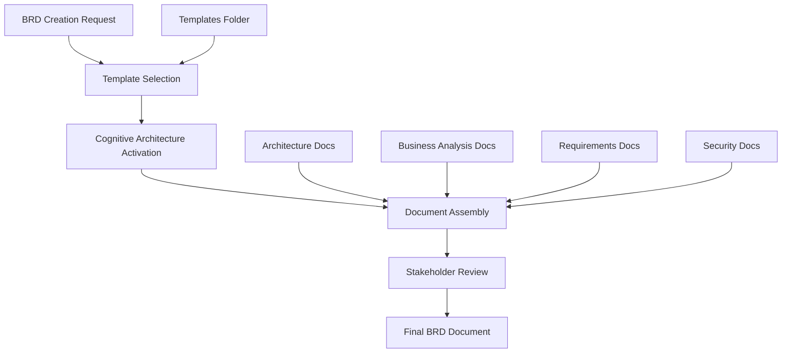
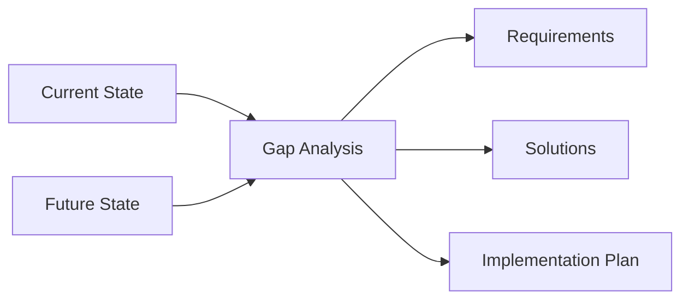
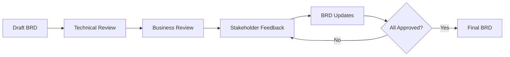
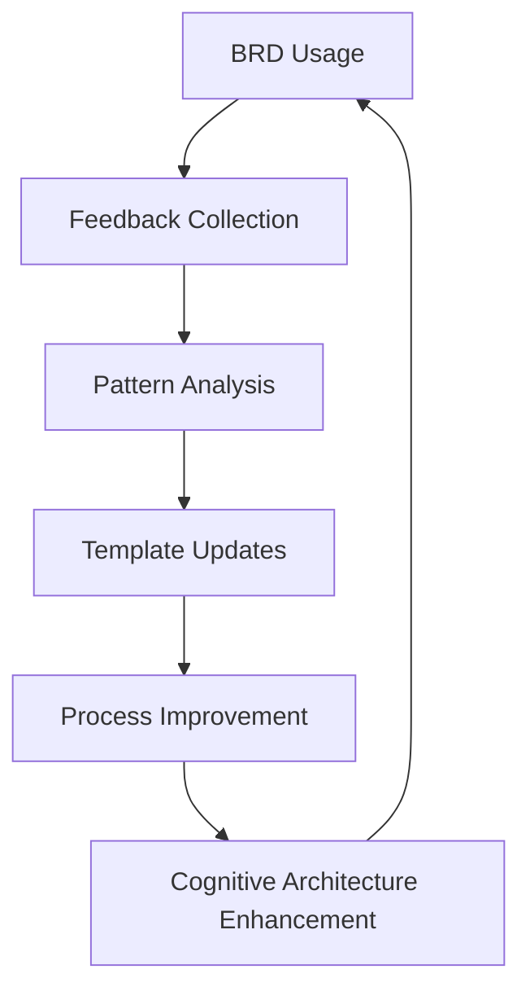

# Business Requirements Document (BRD) Creation Guide

## BRD Creation Overview

| Field                      | Value                                   |
| -------------------------- | --------------------------------------- |
| **Document Type**          | BRD Creation Guide                      |
| **Version**                | 2.0                                     |
| **Target Audience**        | Business Analysts, Project Managers     |
| **Last Updated**           | [Current Date]                          |
| **Cognitive Architecture** | Integrated with Microsoft BRD Standards |

## Executive Summary

This guide provides comprehensive instructions for creating effective Business Requirements Documents (BRDs) using the Microsoft Internal BRD Cognitive Architecture. It integrates with the template system, documentation framework, and cognitive memory patterns to ensure consistent, high-quality business analysis deliverables.

## BRD Cognitive Architecture Integration

### Memory System Activation

The BRD creation process automatically activates relevant cognitive memory components based on file patterns:

| File Pattern     | Activated Instructions                              | Purpose                               |
| ---------------- | --------------------------------------------------- | ------------------------------------- |
| `*.brd`          | microsoft-brd-standards.instructions.md             | Enhanced BRD formatting and structure |
| `*requirements*` | microsoft-requirements-analysis.instructions.md     | Requirements validation and analysis  |
| `*stakeholder*`  | microsoft-stakeholder-communication.instructions.md | Stakeholder engagement protocols      |
| `*security*`     | microsoft-security-framework.instructions.md        | Security and compliance integration   |

### Template Integration Points



## BRD Structure and Components

### Standard BRD Template Structure

#### 1. Executive Summary
**Purpose**: High-level overview for executive stakeholders
**Template**: `templates/executive-summary.brd`
**Integration**: Links to `docs/presentations/executive-summaries/`

**Key Elements:**
- Business problem statement
- Proposed solution overview
- Investment summary
- Expected benefits
- Risk assessment
- Decision required

#### 2. Business Context
**Purpose**: Establish the business case and strategic alignment
**Template**: `templates/business-context-section.md`

**Key Elements:**
- Strategic objectives alignment
- Current state challenges
- Market drivers
- Competitive landscape
- Success criteria

#### 3. Stakeholder Analysis
**Purpose**: Identify and analyze all project stakeholders
**Reference**: `docs/business-analysis/stakeholder-analysis/stakeholder-analysis-framework.md`

**Key Elements:**
- Stakeholder identification matrix
- Power-interest grid
- Engagement strategies
- Communication plans
- Success metrics

#### 4. Current State Analysis
**Purpose**: Document existing processes, systems, and capabilities
**Reference**: `docs/architecture/current-state/system-architecture-overview.md`

**Key Elements:**
- Process documentation
- System inventory
- Data architecture
- Performance metrics
- Pain points and challenges

#### 5. Future State Vision
**Purpose**: Define the target state and transformation goals
**Reference**: `docs/architecture/future-state/target-architecture-vision.md`

**Key Elements:**
- Target architecture
- Process improvements
- Technology roadmap
- Performance targets
- Success metrics

#### 6. Gap Analysis
**Purpose**: Identify gaps between current and future state
**Reference**: `docs/business-analysis/gap-analysis/gap-analysis-framework.md`

**Key Elements:**
- Capability gaps
- Technology gaps
- Process gaps
- Skills gaps
- Investment requirements

#### 7. Requirements Specification
**Purpose**: Define detailed functional and non-functional requirements
**Reference**: `docs/requirements/functional/functional-requirements-template.md`

**Key Elements:**
- User stories
- Functional requirements
- Non-functional requirements
- Business rules
- Acceptance criteria

#### 8. Solution Architecture
**Purpose**: Define the technical solution approach
**Integration**: Links to architecture documentation

**Key Elements:**
- Technical architecture
- Integration points
- Data flows
- Security considerations
- Performance requirements

#### 9. Implementation Plan
**Purpose**: Define the project execution approach
**Template**: `templates/implementation-plan-section.md`

**Key Elements:**
- Project phases
- Timeline and milestones
- Resource requirements
- Risk mitigation
- Success metrics

#### 10. Financial Analysis
**Purpose**: Provide comprehensive financial justification
**Template**: `templates/financial-analysis-section.md`

**Key Elements:**
- Investment breakdown
- Benefit calculations
- ROI analysis
- Cost-benefit analysis
- Funding requirements

## BRD Creation Process

### Phase 1: Preparation and Planning

#### Step 1: Project Initiation
```yaml
# Project Setup Checklist
preparation:
  stakeholder_identification: required
  scope_definition: required
  success_criteria: required
  timeline_establishment: required
  resource_allocation: required
```

**Activities:**
1. **Stakeholder Identification**: Use stakeholder analysis framework
2. **Scope Definition**: Define project boundaries and constraints
3. **Success Criteria**: Establish measurable outcomes
4. **Resource Planning**: Identify required resources and skills
5. **Timeline Planning**: Create high-level project schedule

#### Step 2: Information Gathering
**Templates**: `templates/stakeholder-interview-guide.md`, `templates/requirements-workshop-agenda.md`

**Data Collection Methods:**
- Stakeholder interviews
- Requirements workshops
- Process observation
- Document analysis
- System analysis
- User surveys

#### Step 3: Current State Documentation
**Reference**: Current state architecture templates

**Documentation Areas:**
- Business processes
- System architecture
- Data architecture
- Organizational structure
- Performance baselines

### Phase 2: Analysis and Design

#### Step 4: Gap Analysis
**Reference**: `docs/business-analysis/gap-analysis/gap-analysis-framework.md`

**Analysis Framework:**


#### Step 5: Requirements Elicitation
**Template**: Functional requirements template

**Requirements Categories:**
- Functional requirements
- Non-functional requirements
- Business rules
- Constraints
- Assumptions

#### Step 6: Solution Design
**Integration**: Architecture documentation framework

**Design Elements:**
- Technical architecture
- Integration design
- Data design
- Security design
- User experience design

### Phase 3: Documentation and Validation

#### Step 7: BRD Assembly
**Process:**
1. Use appropriate templates from `templates/` folder
2. Integrate analysis from `docs/` framework
3. Apply cognitive architecture standards
4. Ensure traceability between sections
5. Validate completeness and consistency

#### Step 8: Stakeholder Review
**Template**: `templates/stakeholder-review-process.md`

**Review Process:**


#### Step 9: Final Documentation
**Quality Assurance Checklist:**
- [ ] All templates properly completed
- [ ] Stakeholder analysis comprehensive
- [ ] Requirements traceable to business objectives
- [ ] Architecture aligned with enterprise standards
- [ ] Financial analysis validated
- [ ] Risk assessment complete
- [ ] Implementation plan realistic
- [ ] Success metrics defined

## BRD Quality Framework

### Quality Dimensions

| Dimension        | Description                         | Measurement              | Target       |
| ---------------- | ----------------------------------- | ------------------------ | ------------ |
| **Completeness** | All required sections included      | Section coverage         | 100%         |
| **Consistency**  | Information aligned across sections | Cross-reference accuracy | 95%          |
| **Clarity**      | Clear and understandable content    | Stakeholder feedback     | 4.0/5.0      |
| **Traceability** | Requirements linked to objectives   | Traceability matrix      | 100%         |
| **Accuracy**     | Information verified and validated  | Review cycles            | <3 revisions |

### Quality Assurance Process

#### Document Review Checklist

**Executive Summary Review:**
- [ ] Business problem clearly stated
- [ ] Solution benefits quantified
- [ ] Investment justified
- [ ] Risks identified and mitigated
- [ ] Decision criteria clear

**Business Context Review:**
- [ ] Strategic alignment demonstrated
- [ ] Market drivers documented
- [ ] Success criteria measurable
- [ ] Constraints identified
- [ ] Assumptions documented

**Stakeholder Analysis Review:**
- [ ] All stakeholders identified
- [ ] Influence and interest assessed
- [ ] Engagement strategies defined
- [ ] Communication plans documented
- [ ] Success metrics established

**Requirements Review:**
- [ ] Requirements complete and testable
- [ ] Business rules documented
- [ ] Non-functional requirements included
- [ ] Acceptance criteria defined
- [ ] Traceability maintained

**Architecture Review:**
- [ ] Current state documented
- [ ] Future state defined
- [ ] Gap analysis complete
- [ ] Solution architecture specified
- [ ] Integration points identified

### Review Gate Criteria

| Review Gate          | Criteria                            | Approvers          | Success Threshold         |
| -------------------- | ----------------------------------- | ------------------ | ------------------------- |
| **Technical Review** | Architecture and requirements       | Technical leads    | No major technical issues |
| **Business Review**  | Business case and stakeholder needs | Business owners    | Business value validated  |
| **Security Review**  | Compliance and security controls    | Security team      | Security requirements met |
| **Executive Review** | Strategic alignment and investment  | Executive sponsors | Business case approved    |

## Advanced BRD Techniques

### Cognitive Architecture Enhancement

#### Memory Pattern Integration
```yaml
# BRD Memory Enhancement
cognitive_enhancement:
  pattern_recognition:
    - requirement_patterns
    - stakeholder_patterns
    - solution_patterns
    - risk_patterns
  
  knowledge_integration:
    - enterprise_architecture
    - business_processes
    - technology_standards
    - security_frameworks
  
  decision_support:
    - option_analysis
    - risk_assessment
    - benefit_calculation
    - implementation_planning
```

#### Automated Quality Checking
- Template completeness validation
- Cross-reference consistency checking
- Stakeholder coverage analysis
- Requirements traceability verification
- Architecture compliance validation

### Advanced Analysis Techniques

#### Quantitative Analysis Methods
- **Cost-Benefit Analysis**: ROI calculations with sensitivity analysis
- **Risk Quantification**: Monte Carlo simulation for risk impact
- **Performance Modeling**: Capacity planning and performance prediction
- **Value Stream Mapping**: Process optimization opportunities

#### Qualitative Analysis Methods
- **Stakeholder Journey Mapping**: Understanding stakeholder experiences
- **Service Design Thinking**: User-centered solution design
- **Systems Thinking**: Understanding complex organizational interactions
- **Change Impact Assessment**: Organizational change implications

## BRD Maintenance and Evolution

### Living Document Approach

#### Version Control Strategy
- Major versions for significant scope changes
- Minor versions for content updates
- Tracking of all stakeholder approvals
- Change log maintenance

#### Continuous Improvement


#### Update Triggers
- Major business changes
- Technology evolution
- Regulatory changes
- Stakeholder feedback
- Process improvements

### Knowledge Management Integration

#### Document Relationships
- Link to related BRDs
- Reference enterprise architecture
- Connect to project portfolios
- Integrate with knowledge bases

#### Lessons Learned Capture
- Project outcome analysis
- Stakeholder feedback integration
- Process improvement identification
- Template enhancement opportunities

## Tools and Technology

### BRD Creation Tools

| Tool Category     | Recommended Tools           | Purpose                           | Integration             |
| ----------------- | --------------------------- | --------------------------------- | ----------------------- |
| **Documentation** | Markdown, VS Code           | Content creation                  | Git version control     |
| **Collaboration** | Microsoft Teams, SharePoint | Stakeholder engagement            | Real-time collaboration |
| **Analysis**      | Lucidchart, Visio           | Process and architecture modeling | Diagram integration     |
| **Requirements**  | Azure DevOps, Jira          | Requirements management           | Traceability tracking   |

### Automation Opportunities

#### Template Automation
- Auto-generation of standard sections
- Stakeholder information pre-population
- Architecture diagram creation
- Requirements traceability matrices

#### Quality Automation
- Completeness checking
- Consistency validation
- Standard compliance verification
- Approval workflow management

## Success Metrics and KPIs

### BRD Quality Metrics

| Metric                       | Definition                         | Target       | Measurement Method |
| ---------------------------- | ---------------------------------- | ------------ | ------------------ |
| **Approval Cycle Time**      | Time from draft to final approval  | <30 days     | Project tracking   |
| **Revision Count**           | Number of major revisions required | <3 revisions | Version control    |
| **Stakeholder Satisfaction** | Satisfaction with BRD quality      | >4.0/5.0     | Survey feedback    |
| **Requirements Stability**   | Requirements change rate           | <10%         | Change tracking    |

### Business Impact Metrics

| Metric                     | Definition                                | Target     | Measurement Method     |
| -------------------------- | ----------------------------------------- | ---------- | ---------------------- |
| **Project Success Rate**   | Projects meeting success criteria         | >85%       | Project outcomes       |
| **Time to Value**          | Time from approval to benefit realization | <12 months | Benefit tracking       |
| **Benefit Realization**    | Actual vs. projected benefits             | >90%       | Financial analysis     |
| **Stakeholder Engagement** | Active stakeholder participation          | >80%       | Participation tracking |

---

**Document Owner**: [Chief Business Analyst]  
**Cognitive Architecture**: Microsoft Internal BRD Standards  
**Template Integration**: Complete framework coverage  
**Last Updated**: [Date]  
**Next Review**: [Date]

---

*This guide is designed to work seamlessly with the Microsoft Internal BRD Cognitive Architecture and template system. For specific template usage, refer to individual template files in the templates/ directory.*
