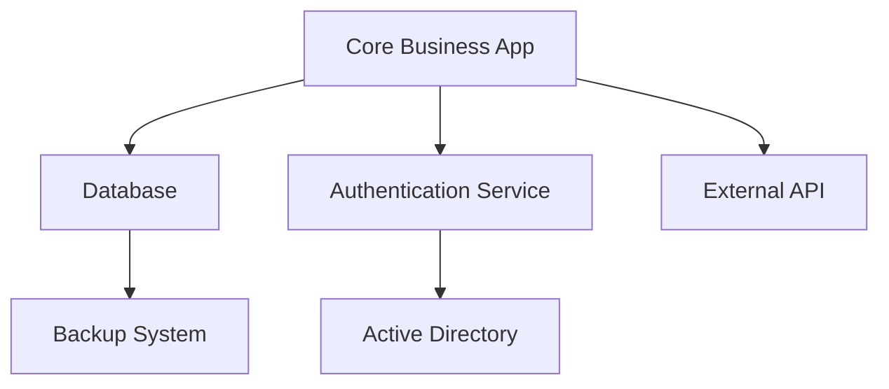
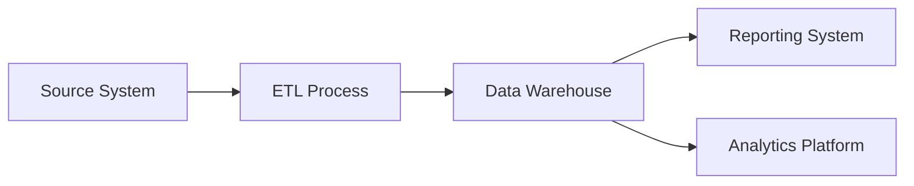

# Current State Architecture Documentation

## System Architecture Overview

| Field             | Value                      |
| ----------------- | -------------------------- |
| **Document Type** | Current State Architecture |
| **Version**       | 1.0                        |
| **Date**          | [Current Date]             |
| **Architect**     | [System Architect Name]    |
| **Review Date**   | [Next Review Date]         |

## Executive Summary

This document captures the current state of our system architecture, including applications, infrastructure, data flows, and integration points. This baseline serves as the foundation for future state planning and transformation initiatives.

## Application Portfolio

### Core Business Applications

| Application | Purpose            | Technology   | Users        | Criticality    |
| ----------- | ------------------ | ------------ | ------------ | -------------- |
| [App Name]  | [Business purpose] | [Tech stack] | [User count] | [High/Med/Low] |
| [App Name]  | [Business purpose] | [Tech stack] | [User count] | [High/Med/Low] |
| [App Name]  | [Business purpose] | [Tech stack] | [User count] | [High/Med/Low] |

### Application Dependencies

## Infrastructure Architecture

### Current Infrastructure Stack

| Layer            | Component      | Technology   | Location   | Notes   |
| ---------------- | -------------- | ------------ | ---------- | ------- |
| **Presentation** | Web Frontend   | [Technology] | [Location] | [Notes] |
| **Application**  | Business Logic | [Technology] | [Location] | [Notes] |
| **Data**         | Database       | [Technology] | [Location] | [Notes] |
| **Integration**  | API Gateway    | [Technology] | [Location] | [Notes] |

### Network Architecture

- **Network Topology**: [Hub-and-spoke / Mesh / Other]
- **Security Zones**: [DMZ, Internal, Restricted]
- **Connectivity**: [VPN, ExpressRoute, Internet]
- **Bandwidth**: [Current capacity and utilization]

### Server Inventory

| Server Name | Role | OS  | CPU/RAM | Location | Last Updated |
| ----------- | ---- | --- | ------- | -------- ||
| [Server 1] | [Role] | [OS] | [Specs] | [Location] | [Date] |
| [Server 2] | [Role] | [OS] | [Specs] | [Location] | [Date] |

## Data Architecture

### Data Sources

| Data Source | Type                | Volume | Update Frequency | Owner   |
| ----------- | ------------------- | ------ | ---------------- | ------- |
| [Source 1]  | [Database/File/API] | [Size] | [Frequency]      | [Owner] |
| [Source 2]  | [Database/File/API] | [Size] | [Frequency]      | [Owner] |

### Data Flow Diagram

### Data Storage

- **Primary Database**: [Technology and specs]
- **Data Warehouse**: [Technology and capacity]
- **File Storage**: [Technology and capacity]
- **Backup Strategy**: [Approach and retention]

## Integration Architecture

### Current Integrations

| System A | System B | Method        | Data Volume | Frequency  | Owner   |
| -------- | -------- | ------------- | ----------- | ---------- | ------- |
| [System] | [System] | [API/File/DB] | [Volume]    | [Schedule] | [Owner] |
| [System] | [System] | [API/File/DB] | [Volume]    | [Schedule] | [Owner] |

### Integration Patterns

- **Synchronous**: [Real-time API calls]
- **Asynchronous**: [Message queues, batch processes]
- **Data Replication**: [ETL/ELT processes]

## Security Architecture

### Security Controls

| Control Type         | Implementation       | Coverage | Notes   |
| -------------------- | -------------------- | -------- | ------- |
| **Authentication**   | [Current method]     | [Scope]  | [Notes] |
| **Authorization**    | [Current method]     | [Scope]  | [Notes] |
| **Network Security** | [Firewalls, etc.]    | [Scope]  | [Notes] |
| **Data Encryption**  | [At rest/in transit] | [Scope]  | [Notes] |

### Compliance Status

- **SOX Compliance**: [Status and notes]
- **GDPR Compliance**: [Status and notes]
- **Industry Standards**: [Applicable standards and status]

## Performance Characteristics

### Current Performance Metrics

| Metric            | Current  | Target | Gap   | Notes     |
| ----------------- | -------- | ------ | ----- | --------- |
| **Response Time** | [Time]   | [Goal] | [Gap] | [Context] |
| **Throughput**    | [Volume] | [Goal] | [Gap] | [Context] |
| **Availability**  | [%]      | [Goal] | [Gap] | [Context] |
| **Reliability**   | [MTBF]   | [Goal] | [Gap] | [Context] |

### Capacity Planning

- **Current Utilization**: [CPU, Memory, Storage, Network]
- **Growth Trends**: [Historical growth patterns]
- **Capacity Limits**: [When limits will be reached]

## Current State Challenges

### Technical Debt

| Issue                 | Impact            | Effort to Fix     | Priority |
| --------------------- | ----------------- | ----------------- | -------- |
| [Technical debt item] | [Business impact] | [Effort estimate] | [H/M/L]  |
| [Technical debt item] | [Business impact] | [Effort estimate] | [H/M/L]  |

### Pain Points

- **Scalability**: [Current limitations]
- **Maintainability**: [Maintenance challenges]
- **Integration**: [Integration difficulties]
- **Performance**: [Performance bottlenecks]

### Risk Assessment

| Risk        | Probability | Impact  | Mitigation Plan      |
| ----------- | ----------- | ------- | -------------------- |
| [Risk item] | [H/M/L]     | [H/M/L] | [Current mitigation] |
| [Risk item] | [H/M/L]     | [H/M/L] | [Current mitigation] |

## Vendor and Licensing

### Software Licenses

| Software   | Version   | License Type | Expiry Date | Annual Cost |
| ---------- | --------- | ------------ | ----------- | ----------- |
| [Software] | [Version] | [Type]       | [Date]      | [Cost]      |
| [Software] | [Version] | [Type]       | [Date]      | [Cost]      |

### Vendor Relationships

| Vendor   | Products/Services | Contract End | Relationship Health |
| -------- | ----------------- | ------------ | ------------------- |
| [Vendor] | [Products]        | [Date]       | [Good/Fair/Poor]    |
| [Vendor] | [Products]        | [Date]       | [Good/Fair/Poor]    |

## Documentation and Knowledge

### Documentation Status

| Area                    | Documentation Quality | Last Updated | Owner   |
| ----------------------- | --------------------- | ------------ | ------- |
| [System Documentation]  | [Good/Fair/Poor]      | [Date]       | [Owner] |
| [Process Documentation] | [Good/Fair/Poor]      | [Date]       | [Owner] |

### Key Personnel

| Role   | Name   | Knowledge Areas | Backup          |
| ------ | ------ | --------------- | --------------- |
| [Role] | [Name] | [Expertise]     | [Backup person] |
| [Role] | [Name] | [Expertise]     | [Backup person] |

## Recommendations for Future State

### Immediate Improvements (0-6 months)
- [Recommendation 1]
- [Recommendation 2]

### Medium-term Enhancements (6-18 months)
- [Recommendation 1]
- [Recommendation 2]

### Strategic Transformation (18+ months)
- [Recommendation 1]
- [Recommendation 2]

---
**Document Owner**: [Name]  
**Last Review**: [Date]  
**Next Review**: [Date]  
**Distribution**: [Who should receive this document]
