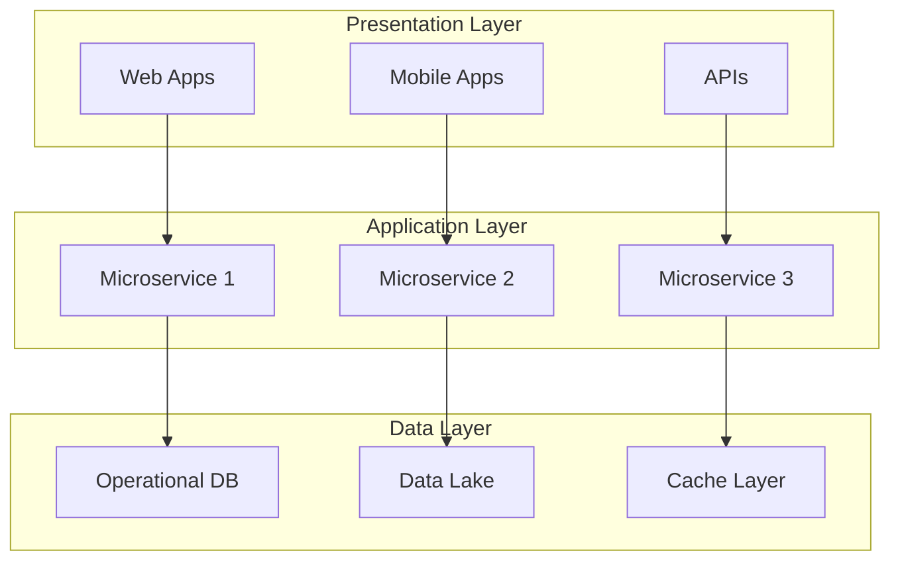
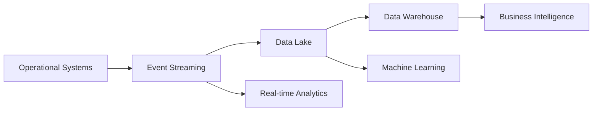
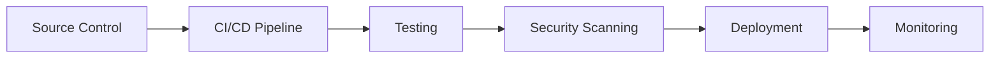

# Future State Architecture Vision

## Architecture Vision Overview

| Field             | Value                     |
| ----------------- | ------------------------- |
| **Document Type** | Future State Architecture |
| **Version**       | 1.0                       |
| **Target Date**   | [Implementation target]   |
| **Architect**     | [Solution Architect Name] |
| **Stakeholders**  | [Key stakeholders]        |

## Executive Summary

This document outlines the target architecture that will enable our organization to achieve its strategic objectives. The future state architecture addresses current limitations while providing scalability, reliability, and innovation capabilities for the next 3-5 years.

## Strategic Drivers

### Business Objectives
- [Strategic objective 1]
- [Strategic objective 2]
- [Strategic objective 3]

### Technical Drivers
- **Scalability**: Support 10x growth in users/transactions
- **Agility**: Reduce deployment time from weeks to hours
- **Reliability**: Achieve 99.9% uptime
- **Security**: Implement zero-trust architecture
- **Cost Optimization**: Reduce infrastructure costs by 30%

## Target Architecture Principles

### Design Principles

| Principle              | Description                        | Impact                         |
| ---------------------- | ---------------------------------- | ------------------------------ |
| **Cloud-First**        | Prioritize cloud-native solutions  | Scalability, cost optimization |
| **API-Driven**         | Everything accessible via APIs     | Integration flexibility        |
| **Microservices**      | Decompose monoliths into services  | Agility, maintainability       |
| **Data-Driven**        | Real-time analytics and insights   | Better decision making         |
| **Security by Design** | Security integrated at every layer | Risk reduction                 |

### Technology Standards

| Layer         | Standard Technology        | Rationale                      |
| ------------- | -------------------------- | ------------------------------ |
| **Frontend**  | React/Angular + TypeScript | Modern, maintainable UI        |
| **Backend**   | .NET Core / Node.js        | Cross-platform, performant     |
| **Database**  | Azure SQL / PostgreSQL     | Managed, scalable              |
| **Container** | Docker + Kubernetes        | Portable, orchestrated         |
| **Cloud**     | Azure / AWS                | Managed services, global scale |

## Future State Architecture

### Application Architecture

### Microservices Architecture

| Service                  | Purpose            | Technology | Data Store | Team Owner    |
| ------------------------ | ------------------ | ---------- | ---------- | ------------- |
| **User Service**         | User management    | .NET Core  | Azure SQL  | Identity Team |
| **Order Service**        | Order processing   | Node.js    | PostgreSQL | Commerce Team |
| **Payment Service**      | Payment processing | Java       | MongoDB    | Payment Team  |
| **Notification Service** | Messaging          | Python     | Redis      | Platform Team |

### Data Architecture

#### Data Strategy
- **Single Source of Truth**: Centralized data lake
- **Real-time Processing**: Stream processing for immediate insights
- **Data Governance**: Automated data quality and lineage
- **Self-service Analytics**: Business user accessible tools

#### Data Flow Architecture

#### Data Stores

| Store Type      | Technology    | Purpose                  | Capacity |
| --------------- | ------------- | ------------------------ | -------- |
| **Operational** | Azure SQL     | Transaction processing   | 5TB      |
| **Analytics**   | Azure Synapse | Data warehousing         | 50TB     |
| **Streaming**   | Event Hubs    | Real-time data           | 10GB/day |
| **Cache**       | Redis         | Performance optimization | 100GB    |

### Infrastructure Architecture

#### Cloud Infrastructure

| Component    | Technology             | Configuration       | Cost/Month |
| ------------ | ---------------------- | ------------------- | ---------- |
| **Compute**  | Azure VMs / Containers | Auto-scaling        | $5,000     |
| **Storage**  | Azure Blob / Files     | Tiered storage      | $2,000     |
| **Network**  | Azure VNet / CDN       | Global distribution | $1,500     |
| **Database** | Azure SQL / Cosmos     | Managed services    | $3,000     |

#### DevOps Platform

### Security Architecture

#### Zero-Trust Security Model

| Layer           | Security Control            | Implementation               |
| --------------- | --------------------------- | ---------------------------- |
| **Identity**    | Multi-factor authentication | Azure AD                     |
| **Device**      | Device compliance           | Intune                       |
| **Network**     | Micro-segmentation          | Azure Firewall               |
| **Application** | Runtime protection          | Azure Security Center        |
| **Data**        | Encryption + DLP            | Azure Information Protection |

#### Security Technologies

- **Identity Management**: Azure Active Directory
- **API Security**: API Management with OAuth 2.0
- **Network Security**: Web Application Firewall
- **Data Security**: Always Encrypted, Key Vault
- **Monitoring**: Azure Sentinel SIEM

### Integration Architecture

#### Integration Patterns

| Pattern          | Use Case                | Technology           | Example          |
| ---------------- | ----------------------- | -------------------- | ---------------- |
| **API Gateway**  | External integrations   | Azure API Management | Partner APIs     |
| **Event-Driven** | Asynchronous processing | Service Bus          | Order processing |
| **ETL/ELT**      | Data integration        | Azure Data Factory   | Data warehouse   |
| **Streaming**    | Real-time data          | Event Hubs           | IoT sensors      |

#### External Integrations

| System            | Integration Method | Data Volume     | Frequency |
| ----------------- | ------------------ | --------------- | --------- |
| **ERP System**    | REST API           | 1M records/day  | Real-time |
| **CRM System**    | Event streaming    | 100K events/day | Real-time |
| **Legacy System** | File transfer      | 10GB/day        | Nightly   |

## Implementation Strategy

### Migration Approach

#### Phase 1: Foundation (Months 1-6)
- **Cloud Infrastructure**: Set up core Azure environment
- **DevOps Platform**: Implement CI/CD pipelines
- **Security Framework**: Deploy identity and access management
- **Data Platform**: Establish data lake and streaming

#### Phase 2: Core Services (Months 7-12)
- **User Service**: Migrate user management
- **API Gateway**: Implement API management
- **Monitoring**: Deploy observability platform
- **Security**: Implement zero-trust controls

#### Phase 3: Business Services (Months 13-18)
- **Order Service**: Migrate order processing
- **Payment Service**: Implement payment processing
- **Analytics**: Deploy business intelligence
- **Mobile**: Launch mobile applications

#### Phase 4: Optimization (Months 19-24)
- **Performance**: Optimize system performance
- **Cost**: Implement cost optimization
- **Features**: Add advanced features
- **Training**: Complete user training

### Risk Mitigation

| Risk               | Probability | Impact | Mitigation Strategy    |
| ------------------ | ----------- | ------ | ---------------------- |
| **Data Migration** | Medium      | High   | Parallel run strategy  |
| **Performance**    | Low         | High   | Load testing program   |
| **Security**       | Medium      | High   | Security review gates  |
| **User Adoption**  | High        | Medium | Change management plan |

### Success Metrics

| Metric                   | Current State | Target State | Measurement            |
| ------------------------ | ------------- | ------------ | ---------------------- |
| **System Availability**  | 95%           | 99.9%        | Uptime monitoring      |
| **Page Load Time**       | 5 seconds     | <2 seconds   | Performance monitoring |
| **Deployment Frequency** | Monthly       | Daily        | DevOps metrics         |
| **Security Incidents**   | 5/month       | <1/month     | Security dashboard     |

## Benefits Realization

### Business Benefits

| Benefit                          | Description                 | Value      | Timeline |
| -------------------------------- | --------------------------- | ---------- | -------- |
| **Increased Agility**            | Faster feature delivery     | $2M/year   | Month 12 |
| **Cost Reduction**               | Infrastructure optimization | $1.5M/year | Month 18 |
| **Improved Customer Experience** | Better performance          | $3M/year   | Month 15 |
| **Risk Reduction**               | Enhanced security           | $500K/year | Month 6  |

### Technical Benefits

- **Scalability**: Auto-scaling to handle demand spikes
- **Reliability**: Improved system uptime and recovery
- **Maintainability**: Easier system updates and fixes
- **Observability**: Better system monitoring and debugging
- **Compliance**: Automated compliance checking

## Investment Requirements

### Initial Investment

| Category                  | Year 1 | Year 2 | Year 3  | Total   |
| ------------------------- | ------ | ------ | ------- | ------- |
| **Cloud Infrastructure**  | $500K  | $600K  | $700K   | $1.8M   |
| **Software Licenses**     | $200K  | $250K  | $300K   | $750K   |
| **Professional Services** | $800K  | $400K  | $200K   | $1.4M   |
| **Training**              | $100K  | $50K   | $25K    | $175K   |
| **Total**                 | $1.6M  | $1.3M  | $1.225M | $4.125M |

### Ongoing Operational Costs

| Category              | Monthly Cost | Annual Cost |
| --------------------- | ------------ | ----------- |
| **Cloud Services**    | $12K         | $144K       |
| **Software Licenses** | $8K          | $96K        |
| **Support**           | $5K          | $60K        |
| **Total**             | $25K         | $300K       |

## Governance and Standards

### Architecture Governance

- **Architecture Review Board**: Monthly reviews of major changes
- **Technology Standards**: Approved technology stack
- **Design Patterns**: Reusable solution patterns
- **Compliance**: Automated compliance checking

### Documentation Standards

- **Architecture Documentation**: Living documentation in code
- **API Documentation**: OpenAPI specifications
- **Operational Runbooks**: Standardized procedures
- **Decision Records**: Architectural decision tracking

---
**Document Owner**: [Chief Architect]  
**Stakeholder Approval**: [CTO, Business Sponsors]  
**Last Review**: [Date]  
**Next Review**: [Date]
