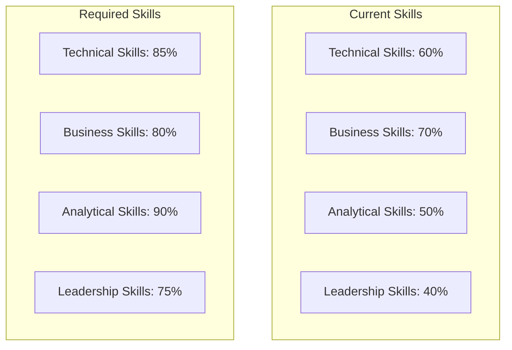
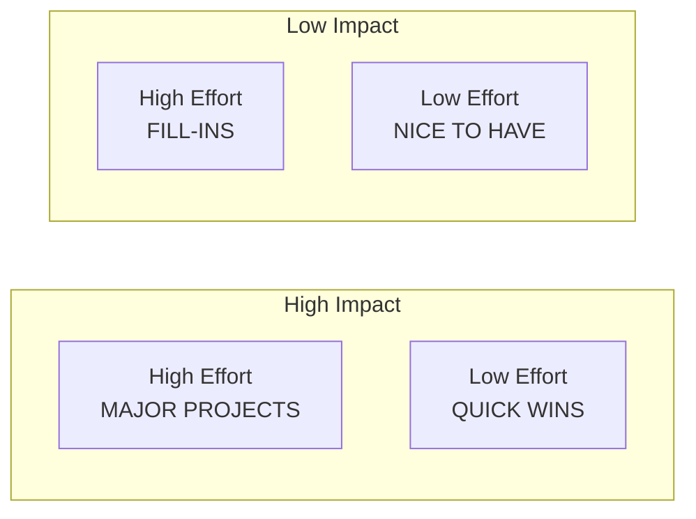

# Gap Analysis Framework

## Gap Analysis Overview

| Field             | Value                   |
| ----------------- | ----------------------- |
| **Document Type** | Gap Analysis            |
| **Project**       | [Project Name]          |
| **Analyst**       | [Business Analyst Name] |
| **Date**          | [Current Date]          |
| **Scope**         | [Analysis scope]        |

## Executive Summary

This gap analysis compares the current state capabilities with the desired future state to identify gaps that must be addressed to achieve business objectives. The analysis covers people, processes, technology, and organizational capabilities.

## Analysis Framework

### Gap Analysis Dimensions

| Dimension        | Description                    | Assessment Method         |
| ---------------- | ------------------------------ | ------------------------- |
| **People**       | Skills, roles, capacity        | Competency assessment     |
| **Process**      | Business processes, workflows  | Process mapping           |
| **Technology**   | Systems, tools, infrastructure | Technical audit           |
| **Organization** | Structure, governance, culture | Organizational assessment |

### Gap Categories

- **Capability Gaps**: Missing abilities or functions
- **Performance Gaps**: Underperforming existing capabilities
- **Capacity Gaps**: Insufficient volume or scale
- **Quality Gaps**: Standards not meeting requirements

## Current State Assessment

### People Assessment

| Role/Skill   | Current Capability | Required Level | Gap Score (1-5) | Comments |
| ------------ | ------------------ | -------------- | --------------- | -------- |
| [Skill/Role] | [Current state]    | [Target state] | [Gap score]     | [Notes]  |
| [Skill/Role] | [Current state]    | [Target state] | [Gap score]     | [Notes]  |
| [Skill/Role] | [Current state]    | [Target state] | [Gap score]     | [Notes]  |

#### Skills Matrix

### Process Assessment

| Process        | Current Maturity | Target Maturity | Gap Description   | Impact            |
| -------------- | ---------------- | --------------- | ----------------- | ----------------- |
| [Process Name] | [Level 1-5]      | [Level 1-5]     | [Gap description] | [Business impact] |
| [Process Name] | [Level 1-5]      | [Level 1-5]     | [Gap description] | [Business impact] |
| [Process Name] | [Level 1-5]      | [Level 1-5]     | [Gap description] | [Business impact] |

#### Process Maturity Scale
1. **Ad Hoc**: Inconsistent, reactive processes
2. **Repeatable**: Basic processes documented
3. **Defined**: Standardized processes across organization
4. **Managed**: Processes measured and controlled
5. **Optimized**: Continuous process improvement

### Technology Assessment

| Technology Area | Current State        | Target State          | Gap Analysis      | Priority       |
| --------------- | -------------------- | --------------------- | ----------------- | -------------- |
| [Technology]    | [Current capability] | [Required capability] | [Gap description] | [High/Med/Low] |
| [Technology]    | [Current capability] | [Required capability] | [Gap description] | [High/Med/Low] |
| [Technology]    | [Current capability] | [Required capability] | [Gap description] | [High/Med/Low] |

#### Technology Stack Comparison

| Component       | Current        | Target        | Gap Type              | Effort            |
| --------------- | -------------- | ------------- | --------------------- | ----------------- |
| **Frontend**    | [Current tech] | [Target tech] | [Upgrade/Replace/New] | [Effort estimate] |
| **Backend**     | [Current tech] | [Target tech] | [Upgrade/Replace/New] | [Effort estimate] |
| **Database**    | [Current tech] | [Target tech] | [Upgrade/Replace/New] | [Effort estimate] |
| **Integration** | [Current tech] | [Target tech] | [Upgrade/Replace/New] | [Effort estimate] |

### Organizational Assessment

| Capability          | Current State     | Target State     | Gap Description | Impact              |
| ------------------- | ----------------- | ---------------- | --------------- | ------------------- |
| **Governance**      | [Current model]   | [Target model]   | [Gap details]   | [Impact assessment] |
| **Culture**         | [Current culture] | [Target culture] | [Gap details]   | [Impact assessment] |
| **Structure**       | [Current org]     | [Target org]     | [Gap details]   | [Impact assessment] |
| **Decision Making** | [Current process] | [Target process] | [Gap details]   | [Impact assessment] |

## Detailed Gap Analysis

### Critical Gaps (High Impact, High Priority)

#### Gap 1: [Gap Name]
- **Category**: [People/Process/Technology/Organization]
- **Current State**: [Detailed description]
- **Future State**: [Detailed description]
- **Impact**: [Business impact if not addressed]
- **Root Causes**: 
  - [Root cause 1]
  - [Root cause 2]
- **Dependencies**: [What depends on this gap being filled]
- **Recommended Solution**: [Approach to close the gap]
- **Timeline**: [Estimated time to close]
- **Resources Required**: [People, budget, tools needed]

#### Gap 2: [Gap Name]
- **Category**: [People/Process/Technology/Organization]
- **Current State**: [Detailed description]
- **Future State**: [Detailed description]
- **Impact**: [Business impact if not addressed]
- **Root Causes**: 
  - [Root cause 1]
  - [Root cause 2]
- **Dependencies**: [What depends on this gap being filled]
- **Recommended Solution**: [Approach to close the gap]
- **Timeline**: [Estimated time to close]
- **Resources Required**: [People, budget, tools needed]

### Moderate Gaps (Medium Impact, Medium Priority)

| Gap        | Category   | Impact               | Solution Summary    | Timeline   |
| ---------- | ---------- | -------------------- | ------------------- | ---------- |
| [Gap name] | [Category] | [Impact description] | [Solution approach] | [Timeline] |
| [Gap name] | [Category] | [Impact description] | [Solution approach] | [Timeline] |

### Minor Gaps (Low Impact, Low Priority)

| Gap        | Category   | Impact               | Solution Summary    | Timeline   |
| ---------- | ---------- | -------------------- | ------------------- | ---------- |
| [Gap name] | [Category] | [Impact description] | [Solution approach] | [Timeline] |
| [Gap name] | [Category] | [Impact description] | [Solution approach] | [Timeline] |

## Gap Prioritization Matrix

### Gap Prioritization

| Gap        | Impact         | Effort         | Priority                  | Rationale       |
| ---------- | -------------- | -------------- | ------------------------- | --------------- |
| [Gap name] | [High/Med/Low] | [High/Med/Low] | [Critical/Important/Nice] | [Justification] |
| [Gap name] | [High/Med/Low] | [High/Med/Low] | [Critical/Important/Nice] | [Justification] |

## Solution Strategies

### People Gaps Solutions

#### Training and Development
| Gap         | Training Solution  | Duration | Cost   | Provider            |
| ----------- | ------------------ | -------- | ------ | ------------------- |
| [Skill gap] | [Training program] | [Time]   | [Cost] | [Internal/External] |
| [Skill gap] | [Training program] | [Time]   | [Cost] | [Internal/External] |

#### Hiring Strategy
| Role   | Skills Needed | Timeline   | Recruitment Strategy |
| ------ | ------------- | ---------- | -------------------- |
| [Role] | [Skills]      | [Timeline] | [Strategy]           |
| [Role] | [Skills]      | [Timeline] | [Strategy]           |

#### Organizational Changes
- **Role Redefinition**: [Changes needed]
- **New Positions**: [Positions to create]
- **Team Restructuring**: [Structural changes]

### Process Gaps Solutions

#### Process Improvements
| Process   | Current Issue | Solution Approach | Expected Outcome |
| --------- | ------------- | ----------------- | ---------------- |
| [Process] | [Issue]       | [Solution]        | [Outcome]        |
| [Process] | [Issue]       | [Solution]        | [Outcome]        |

#### New Processes Required
- **[Process Name]**: [Description and rationale]
- **[Process Name]**: [Description and rationale]

### Technology Gaps Solutions

#### Technology Roadmap
| Quarter | Technology Initiative | Budget   | Dependencies   |
| ------- | --------------------- | -------- | -------------- |
| Q1      | [Initiative]          | [Budget] | [Dependencies] |
| Q2      | [Initiative]          | [Budget] | [Dependencies] |
| Q3      | [Initiative]          | [Budget] | [Dependencies] |
| Q4      | [Initiative]          | [Budget] | [Dependencies] |

#### Implementation Approach
- **Phase 1**: [Foundation technologies]
- **Phase 2**: [Core business systems]
- **Phase 3**: [Advanced capabilities]
- **Phase 4**: [Optimization and enhancement]

### Organizational Gaps Solutions

#### Change Management Strategy
- **Communication Plan**: [How to communicate changes]
- **Training Plan**: [How to prepare organization]
- **Governance Changes**: [New decision structures]
- **Cultural Initiatives**: [Culture change programs]

## Implementation Plan

### Phase 1: Critical Gaps (Months 1-6)
| Gap   | Solution   | Owner   | Budget   | Success Criteria |
| ----- | ---------- | ------- | -------- | ---------------- |
| [Gap] | [Solution] | [Owner] | [Budget] | [Criteria]       |
| [Gap] | [Solution] | [Owner] | [Budget] | [Criteria]       |

### Phase 2: Important Gaps (Months 7-12)
| Gap   | Solution   | Owner   | Budget   | Success Criteria |
| ----- | ---------- | ------- | -------- | ---------------- |
| [Gap] | [Solution] | [Owner] | [Budget] | [Criteria]       |
| [Gap] | [Solution] | [Owner] | [Budget] | [Criteria]       |

### Phase 3: Enhancement Gaps (Months 13-18)
| Gap   | Solution   | Owner   | Budget   | Success Criteria |
| ----- | ---------- | ------- | -------- | ---------------- |
| [Gap] | [Solution] | [Owner] | [Budget] | [Criteria]       |
| [Gap] | [Solution] | [Owner] | [Budget] | [Criteria]       |

## Investment Analysis

### Total Investment Required

| Category         | Year 1    | Year 2    | Year 3    | Total    |
| ---------------- | --------- | --------- | --------- | -------- |
| **People**       | $[Amount] | $[Amount] | $[Amount] | $[Total] |
| **Process**      | $[Amount] | $[Amount] | $[Amount] | $[Total] |
| **Technology**   | $[Amount] | $[Amount] | $[Amount] | $[Total] |
| **Organization** | $[Amount] | $[Amount] | $[Amount] | $[Total] |
| **Total**        | $[Amount] | $[Amount] | $[Amount] | $[Total] |

### Return on Investment

| Gap Solution | Investment | Annual Benefit | ROI     | Payback Period |
| ------------ | ---------- | -------------- | ------- | -------------- |
| [Solution]   | $[Amount]  | $[Benefit]     | [ROI %] | [Months]       |
| [Solution]   | $[Amount]  | $[Benefit]     | [ROI %] | [Months]       |

## Risk Assessment

### Implementation Risks

| Risk   | Probability    | Impact         | Gap Affected | Mitigation Strategy |
| ------ | -------------- | -------------- | ------------ | ------------------- |
| [Risk] | [High/Med/Low] | [High/Med/Low] | [Gap name]   | [Mitigation]        |
| [Risk] | [High/Med/Low] | [High/Med/Low] | [Gap name]   | [Mitigation]        |

### Contingency Plans

- **Budget Overruns**: [Contingency approach]
- **Timeline Delays**: [Contingency approach]
- **Resource Constraints**: [Contingency approach]
- **Scope Changes**: [Contingency approach]

## Success Metrics

### Measurement Framework

| Gap Category     | Metric   | Baseline  | Target   | Measurement Method |
| ---------------- | -------- | --------- | -------- | ------------------ |
| **People**       | [Metric] | [Current] | [Target] | [How to measure]   |
| **Process**      | [Metric] | [Current] | [Target] | [How to measure]   |
| **Technology**   | [Metric] | [Current] | [Target] | [How to measure]   |
| **Organization** | [Metric] | [Current] | [Target] | [How to measure]   |

### Progress Tracking

- **Monthly Reviews**: Track gap closure progress
- **Quarterly Assessments**: Comprehensive metric review
- **Annual Re-assessment**: Full gap analysis update

---
**Document Owner**: [Business Analyst Name]  
**Stakeholder Approval**: [Project Sponsor]  
**Last Review**: [Date]  
**Next Review**: [Date]
