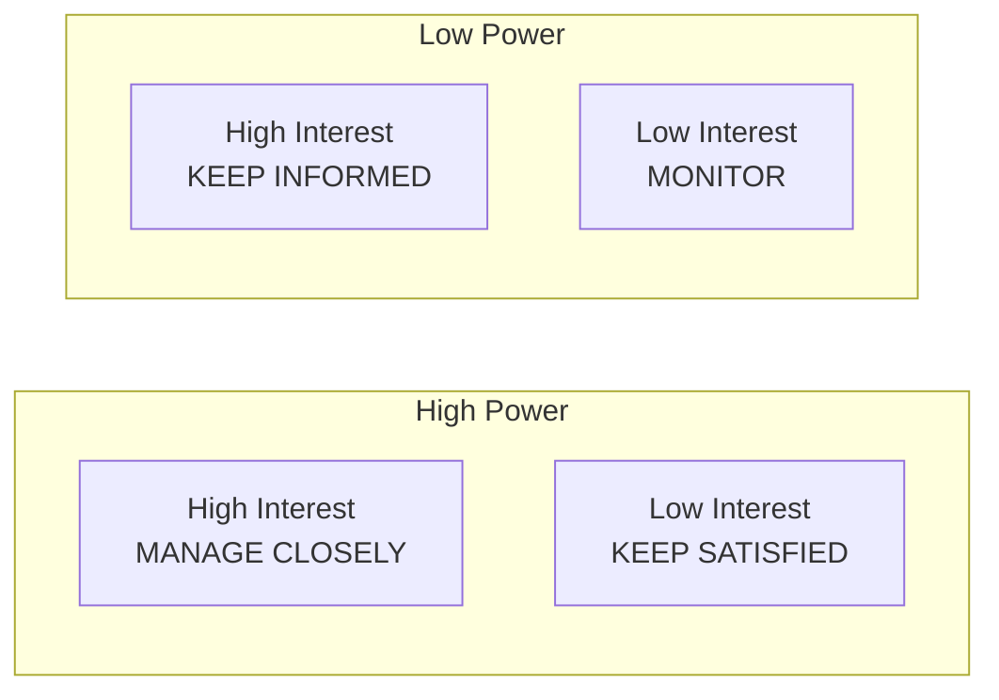
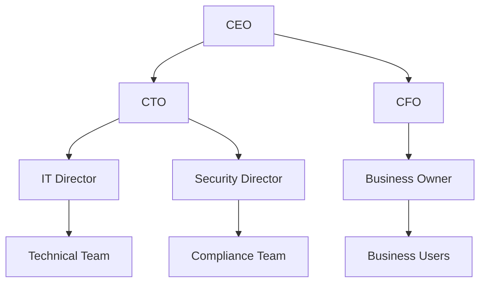

# Stakeholder Analysis Framework

## Stakeholder Analysis Overview

| Field             | Value                   |
| ----------------- | ----------------------- |
| **Document Type** | Stakeholder Analysis    |
| **Project**       | [Project Name]          |
| **Analyst**       | [Business Analyst Name] |
| **Date**          | [Current Date]          |
| **Review Cycle**  | [Quarterly/Semi-annual] |

## Executive Summary

This stakeholder analysis identifies and categorizes all individuals, groups, and organizations that may affect or be affected by the project. Understanding stakeholder dynamics is critical for project success and enables targeted engagement strategies.

## Stakeholder Identification Matrix

### Primary Stakeholders (Direct Impact)

| Stakeholder | Role/Title | Organization | Influence Level | Interest Level | Impact                    |
| ----------- | ---------- | ------------ | --------------- | -------------- | ------------------------- |
| [Name]      | [Title]    | [Dept/Org]   | High/Med/Low    | High/Med/Low   | Positive/Negative/Neutral |
| [Name]      | [Title]    | [Dept/Org]   | High/Med/Low    | High/Med/Low   | Positive/Negative/Neutral |
| [Name]      | [Title]    | [Dept/Org]   | High/Med/Low    | High/Med/Low   | Positive/Negative/Neutral |

### Secondary Stakeholders (Indirect Impact)

| Stakeholder | Role/Title | Organization | Influence Level | Interest Level | Impact                    |
| ----------- | ---------- | ------------ | --------------- | -------------- | ------------------------- |
| [Name]      | [Title]    | [Dept/Org]   | High/Med/Low    | High/Med/Low   | Positive/Negative/Neutral |
| [Name]      | [Title]    | [Dept/Org]   | High/Med/Low    | High/Med/Low   | Positive/Negative/Neutral |

### External Stakeholders

| Stakeholder | Organization   | Relationship              | Influence Level | Interest Level |
| ----------- | -------------- | ------------------------- | --------------- | -------------- |
| [Name/Org]  | [External org] | [Partner/Vendor/Customer] | High/Med/Low    | High/Med/Low   |
| [Name/Org]  | [External org] | [Partner/Vendor/Customer] | High/Med/Low    | High/Med/Low   |

## Stakeholder Power-Interest Grid

### Stakeholder Categorization

#### Manage Closely (High Power, High Interest)
| Stakeholder         | Reason                                  | Engagement Strategy                       |
| ------------------- | --------------------------------------- | ----------------------------------------- |
| [Executive Sponsor] | Decision authority and project champion | Weekly 1:1s, executive steering committee |
| [Business Owner]    | Budget authority and success metrics    | Bi-weekly reviews, detailed reporting     |

#### Keep Satisfied (High Power, Low Interest)
| Stakeholder          | Reason                                        | Engagement Strategy                  |
| -------------------- | --------------------------------------------- | ------------------------------------ |
| [IT Director]        | Technical authority but not directly involved | Monthly updates, technical briefings |
| [Compliance Officer] | Regulatory oversight authority                | Quarterly compliance reviews         |

#### Keep Informed (Low Power, High Interest)
| Stakeholder    | Reason                          | Engagement Strategy                                 |
| -------------- | ------------------------------- | --------------------------------------------------- |
| [End Users]    | Daily system users, high impact | User forums, training sessions, feedback collection |
| [Support Team] | Will support the solution       | Training programs, documentation                    |

#### Monitor (Low Power, Low Interest)
| Stakeholder      | Reason                              | Engagement Strategy            |
| ---------------- | ----------------------------------- | ------------------------------ |
| [Adjacent Teams] | Minimal impact but awareness needed | Newsletter updates, town halls |

## Detailed Stakeholder Profiles

### [Executive Sponsor Name]
- **Role**: [Title and department]
- **Responsibilities**: [Key responsibilities related to project]
- **Interests**: [What they care about most]
- **Concerns**: [Potential objections or worries]
- **Influence**: [How they can impact the project]
- **Communication Preference**: [Email, meetings, formal reports]
- **Success Metrics**: [How they measure success]
- **Engagement Frequency**: [How often to communicate]

### [Business Owner Name]
- **Role**: [Title and department]
- **Responsibilities**: [Key responsibilities related to project]
- **Interests**: [What they care about most]
- **Concerns**: [Potential objections or worries]
- **Influence**: [How they can impact the project]
- **Communication Preference**: [Email, meetings, formal reports]
- **Success Metrics**: [How they measure success]
- **Engagement Frequency**: [How often to communicate]

### [Technical Lead Name]
- **Role**: [Title and department]
- **Responsibilities**: [Key responsibilities related to project]
- **Interests**: [What they care about most]
- **Concerns**: [Potential objections or worries]
- **Influence**: [How they can impact the project]
- **Communication Preference**: [Email, meetings, formal reports]
- **Success Metrics**: [How they measure success]
- **Engagement Frequency**: [How often to communicate]

## Stakeholder Influence Network

### Key Influence Relationships
- **[Stakeholder A]** influences **[Stakeholder B]** through [relationship/authority]
- **[Stakeholder C]** has veto power over [specific decisions]
- **[Stakeholder D]** coalition can override [certain decisions]

## Stakeholder Needs Analysis

### Business Stakeholders

| Stakeholder       | Primary Needs             | Success Criteria   | Potential Barriers   |
| ----------------- | ------------------------- | ------------------ | -------------------- |
| [Business Owner]  | [ROI, efficiency]         | [Specific metrics] | [Budget constraints] |
| [Department Head] | [Operational improvement] | [Specific metrics] | [Change resistance]  |

### Technical Stakeholders

| Stakeholder        | Primary Needs           | Success Criteria     | Potential Barriers        |
| ------------------ | ----------------------- | -------------------- | ------------------------- |
| [Technical Lead]   | [Maintainable solution] | [Technical metrics]  | [Resource constraints]    |
| [Security Officer] | [Secure implementation] | [Security standards] | [Compliance requirements] |

### End User Stakeholders

| Stakeholder   | Primary Needs       | Success Criteria     | Potential Barriers   |
| ------------- | ------------------- | -------------------- | -------------------- |
| [Daily Users] | [Ease of use]       | [User satisfaction]  | [Training needs]     |
| [Power Users] | [Advanced features] | [Productivity gains] | [Feature complexity] |

## Stakeholder Engagement Strategy

### Communication Plan

| Stakeholder Group  | Message            | Method              | Frequency | Responsible      |
| ------------------ | ------------------ | ------------------- | --------- | ---------------- |
| **Executives**     | Strategic progress | Executive dashboard | Weekly    | Project Manager  |
| **Business Users** | Feature updates    | Newsletter          | Bi-weekly | Business Analyst |
| **Technical Team** | Technical progress | Stand-ups           | Daily     | Technical Lead   |
| **Support Staff**  | Training materials | Documentation       | As needed | Training Team    |

### Engagement Activities

#### Regular Meetings
- **Executive Steering Committee**: Monthly strategic oversight
- **Business Review Board**: Bi-weekly progress reviews
- **Technical Working Group**: Weekly technical decisions
- **User Advisory Group**: Monthly feedback sessions

#### Communication Channels
- **Executive Dashboard**: Real-time project metrics
- **Project Newsletter**: Bi-weekly updates
- **Technical Wiki**: Living technical documentation
- **User Forum**: Community support and feedback

### Stakeholder Escalation Matrix

| Issue Level | Stakeholder        | Response Time   | Contact Method     |
| ----------- | ------------------ | --------------- | ------------------ |
| **Level 1** | Project Manager    | 4 hours         | Email/Phone        |
| **Level 2** | Business Owner     | 1 business day  | Meeting            |
| **Level 3** | Executive Sponsor  | 2 business days | Executive briefing |
| **Level 4** | Steering Committee | 1 week          | Emergency meeting  |

## Risk Assessment

### Stakeholder Risks

| Risk                     | Stakeholder | Probability | Impact | Mitigation Strategy        |
| ------------------------ | ----------- | ----------- | ------ | -------------------------- |
| **Resistance to Change** | End Users   | High        | Medium | Change management program  |
| **Budget Cuts**          | CFO         | Medium      | High   | Strong business case       |
| **Competing Priorities** | IT Director | Medium      | Medium | Resource planning          |
| **Regulatory Changes**   | Compliance  | Low         | High   | Regular compliance reviews |

### Mitigation Strategies

#### High-Risk Stakeholders
- **[Stakeholder]**: [Specific mitigation approach]
- **[Stakeholder]**: [Specific mitigation approach]

#### Coalition Building
- **Champions**: [Identify and leverage supporters]
- **Influencers**: [Engage key influencers]
- **Early Adopters**: [Target willing participants]

## Stakeholder Success Metrics

### Engagement Metrics

| Metric                     | Target   | Current         | Trend            |
| -------------------------- | -------- | --------------- | ---------------- |
| **Meeting Attendance**     | >90%     | [Current %]     | [Up/Down/Stable] |
| **Response Rate**          | >80%     | [Current %]     | [Up/Down/Stable] |
| **Satisfaction Score**     | >4.0/5.0 | [Current score] | [Up/Down/Stable] |
| **Action Item Completion** | >95%     | [Current %]     | [Up/Down/Stable] |

### Business Outcomes

| Stakeholder      | Success Metric       | Target           | Current Status    |
| ---------------- | -------------------- | ---------------- | ----------------- |
| [Business Owner] | [ROI/Efficiency]     | [Target value]   | [Current value]   |
| [End Users]      | [User Satisfaction]  | [Target score]   | [Current score]   |
| [Technical Team] | [System Performance] | [Target metrics] | [Current metrics] |

## Action Items and Next Steps

### Immediate Actions (Next 30 days)
1. **[Action]**: [Description and owner]
2. **[Action]**: [Description and owner]
3. **[Action]**: [Description and owner]

### Medium-term Actions (30-90 days)
1. **[Action]**: [Description and owner]
2. **[Action]**: [Description and owner]

### Ongoing Activities
1. **[Activity]**: [Description and frequency]
2. **[Activity]**: [Description and frequency]

## Review and Updates

### Regular Review Schedule
- **Monthly**: Update stakeholder engagement metrics
- **Quarterly**: Comprehensive stakeholder analysis review
- **Major Milestones**: Re-assess stakeholder positions
- **Project Changes**: Update impact and interest levels

### Document Control
- **Version Control**: Track changes and approvals
- **Distribution List**: Ensure appropriate stakeholders receive updates
- **Feedback Mechanism**: Regular stakeholder input on analysis accuracy

---
**Document Owner**: [Business Analyst Name]  
**Stakeholder Approval**: [Executive Sponsor]  
**Last Review**: [Date]  
**Next Review**: [Date]  
**Distribution**: [Stakeholder list]
