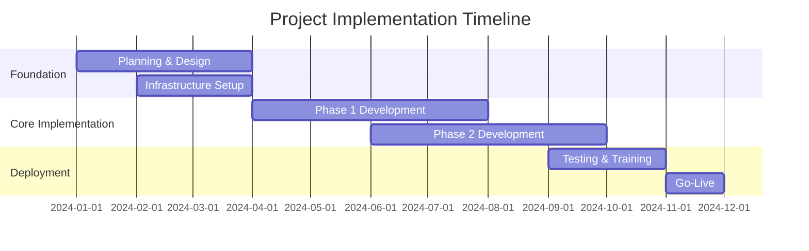

# Executive Summary Template

## Executive Summary Overview

| Field                 | Value                       |
| --------------------- | --------------------------- |
| **Document Type**     | Executive Summary           |
| **Project**           | [Project Name]              |
| **Date**              | [Current Date]              |
| **Presenter**         | [Executive Sponsor]         |
| **Audience**          | [Executive Committee/Board] |
| **Decision Required** | [Yes/No - Decision Details] |

---

## Project Overview

### Strategic Context
[Brief 2-3 sentence description of why this project matters to the organization's strategic objectives]

### Business Problem
[1-2 paragraphs describing the business challenge or opportunity this project addresses]

### Proposed Solution
[High-level description of the recommended approach - keep technical details minimal]

---

## Business Case Summary

### Investment Overview

| Component                 | Amount     | Timeline        |
| ------------------------- | ---------- | --------------- |
| **Total Investment**      | $[X.X]M    | [X] months      |
| **Annual Operating Cost** | $[X.X]M    | Starting [Year] |
| **Break-even Point**      | [X] months | [Date]          |
| **3-Year NPV**            | $[X.X]M    | [ROI %]         |

### Expected Benefits

| Benefit Category        | Annual Value | Realization Timeline |
| ----------------------- | ------------ | -------------------- |
| **Cost Savings**        | $[X.X]M      | [Timeline]           |
| **Revenue Enhancement** | $[X.X]M      | [Timeline]           |
| **Risk Mitigation**     | $[X.X]M      | [Timeline]           |
| **Efficiency Gains**    | $[X.X]M      | [Timeline]           |

### Strategic Value
- **[Strategic Objective 1]**: [How project supports this objective]
- **[Strategic Objective 2]**: [How project supports this objective]
- **Competitive Advantage**: [Specific advantages gained]

---

## Key Success Factors

### Critical Success Metrics

| Metric              | Baseline  | Year 1 Target | Year 3 Target |
| ------------------- | --------- | ------------- | ------------- |
| [Primary KPI]       | [Current] | [Target]      | [Target]      |
| [Secondary KPI]     | [Current] | [Target]      | [Target]      |
| [Efficiency Metric] | [Current] | [Target]      | [Target]      |

### Success Dependencies
1. **[Critical Dependency 1]**: [Brief description and mitigation]
2. **[Critical Dependency 2]**: [Brief description and mitigation]
3. **[Critical Dependency 3]**: [Brief description and mitigation]

---

## Implementation Summary

### Project Timeline

### Key Milestones

| Milestone            | Date   | Success Criteria                               |
| -------------------- | ------ | ---------------------------------------------- |
| **Project Kickoff**  | [Date] | Project team assembled, charter approved       |
| **Design Complete**  | [Date] | Architecture approved, requirements signed off |
| **Phase 1 Delivery** | [Date] | Core functionality operational                 |
| **User Acceptance**  | [Date] | Business acceptance criteria met               |
| **Go-Live**          | [Date] | System operational, users trained              |

### Resource Requirements

| Resource Type         | Commitment | Duration           | Notes           |
| --------------------- | ---------- | ------------------ | --------------- |
| **Executive Sponsor** | 20%        | Full project       | [Sponsor name]  |
| **Business Owner**    | 50%        | Full project       | [Owner name]    |
| **Project Team**      | 100%       | [Duration]         | [Team size] FTE |
| **Business Users**    | 25%        | Testing & Training | [Number] users  |

---

## Risk Assessment

### Top Risks and Mitigation

| Risk         | Probability    | Impact         | Mitigation Strategy   |
| ------------ | -------------- | -------------- | --------------------- |
| **[Risk 1]** | [High/Med/Low] | [High/Med/Low] | [Mitigation approach] |
| **[Risk 2]** | [High/Med/Low] | [High/Med/Low] | [Mitigation approach] |
| **[Risk 3]** | [High/Med/Low] | [High/Med/Low] | [Mitigation approach] |

### Risk Management Approach
- **Governance**: [Risk oversight structure]
- **Monitoring**: [Risk tracking and reporting frequency]
- **Contingency**: [Backup plans for critical risks]

---

## Options Analysis

### Option 1: [Recommended Option]
- **Description**: [Brief description]
- **Investment**: $[Amount]
- **Benefits**: [Key benefits]
- **Risk Level**: [Assessment]
- **Timeline**: [Duration]

### Option 2: [Alternative Option]
- **Description**: [Brief description]
- **Investment**: $[Amount]
- **Benefits**: [Key benefits]
- **Risk Level**: [Assessment]
- **Timeline**: [Duration]

### Option 3: Status Quo
- **Description**: Continue current state
- **Investment**: $[Ongoing costs]
- **Risks**: [Risks of not acting]
- **Opportunity Cost**: [What we miss by not acting]

### Recommendation Rationale
[2-3 sentences explaining why Option 1 is recommended over alternatives]

---

## Stakeholder Impact

### Primary Stakeholders

| Stakeholder Group    | Impact               | Change Required      | Support Level  |
| -------------------- | -------------------- | -------------------- | -------------- |
| **[Department 1]**   | [Impact description] | [Change description] | [High/Med/Low] |
| **[Department 2]**   | [Impact description] | [Change description] | [High/Med/Low] |
| **[External Group]** | [Impact description] | [Change description] | [High/Med/Low] |

### Change Management Strategy
- **Communication Plan**: [Approach to stakeholder communication]
- **Training Strategy**: [User training and support approach]
- **Support Model**: [Ongoing support structure]

---

## Technology and Innovation

### Technology Strategy Alignment
- **Current State**: [Brief technology landscape]
- **Future State**: [Target technology vision]
- **Innovation Opportunity**: [How project advances technology strategy]

### Digital Transformation Impact
- **Process Digitization**: [Processes being automated/digitized]
- **Data and Analytics**: [New data capabilities]
- **User Experience**: [Improvements to user interaction]

---

## Financial Summary

### Investment Breakdown

| Category                  | Year 1    | Year 2    | Year 3    | Total          |
| ------------------------- | --------- | --------- | --------- | -------------- |
| **Technology**            | $[Amount] | $[Amount] | $[Amount] | $[Total]       |
| **Professional Services** | $[Amount] | $[Amount] | $[Amount] | $[Total]       |
| **Internal Resources**    | $[Amount] | $[Amount] | $[Amount] | $[Total]       |
| **Training & Change**     | $[Amount] | $[Amount] | $[Amount] | $[Total]       |
| **Total Investment**      | $[Total]  | $[Total]  | $[Total]  | $[Grand Total] |

### Return on Investment

| Financial Metric            | Value      | Calculation Method                  |
| --------------------------- | ---------- | ----------------------------------- |
| **Payback Period**          | [X] months | [Method]                            |
| **Net Present Value**       | $[X.X]M    | [Discount rate]% over [years] years |
| **Internal Rate of Return** | [X]%       | [Calculation period]                |
| **Return on Investment**    | [X]%       | 3-year cumulative                   |

---

## Decision Framework

### Go/No-Go Criteria

| Criteria                  | Threshold | Current Status | Met?  |
| ------------------------- | --------- | -------------- | ----- |
| **Business Case ROI**     | >15%      | [Current %]    | [✓/✗] |
| **Stakeholder Support**   | >80%      | [Current %]    | [✓/✗] |
| **Resource Availability** | Confirmed | [Status]       | [✓/✗] |
| **Technical Feasibility** | Proven    | [Status]       | [✓/✗] |

### Decision Required
**[Specific decision needed from executives - be explicit about what you're asking for]**

### Options for Executive Decision:
1. **Approve and Proceed**: Full project approval with requested investment
2. **Approve with Modifications**: Conditional approval with specified changes
3. **Defer Decision**: Request additional information or analysis
4. **Reject Proposal**: Do not proceed with project

---

## Next Steps

### Immediate Actions (If Approved)
1. **[Action 1]** - [Owner] - [Timeline]
2. **[Action 2]** - [Owner] - [Timeline]
3. **[Action 3]** - [Owner] - [Timeline]

### Communication Plan
- **Announcement**: [How and when decision will be communicated]
- **Stakeholder Briefings**: [Who needs to be informed and when]
- **Project Kickoff**: [Next steps to begin execution]

### Success Tracking
- **Reporting Frequency**: [How often executives will receive updates]
- **Review Points**: [Scheduled checkpoints for project assessment]
- **Success Metrics**: [How success will be measured and reported]

---

## Appendices

### Appendix A: Detailed Financial Model
[Reference to detailed financial analysis document]

### Appendix B: Technical Architecture
[Reference to technical design document]

### Appendix C: Risk Register
[Reference to comprehensive risk assessment]

### Appendix D: Stakeholder Analysis
[Reference to stakeholder impact assessment]

---

**Document Prepared By**: [Business Analyst/Project Manager]  
**Executive Sponsor**: [Sponsor Name and Title]  
**Reviewed By**: [Stakeholder Names]  
**Presentation Date**: [Date]  
**Decision Deadline**: [Date]

---

*This executive summary is designed for a [X]-minute presentation with [Y] minutes for questions and discussion.*
