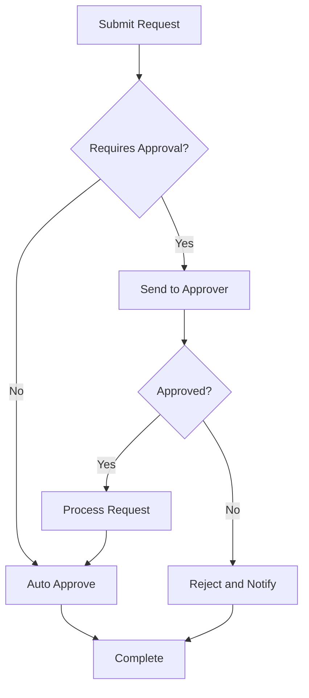

# Functional Requirements Template

## Document Overview

| Field                    | Value                   |
| ------------------------ | ----------------------- |
| **Document Type**        | Functional Requirements |
| **Project**              | [Project Name]          |
| **Version**              | 1.0                     |
| **Date**                 | [Current Date]          |
| **Author**               | [Business Analyst Name] |
| **Stakeholder Approval** | [Stakeholder Names]     |

## Executive Summary

This document defines the functional requirements for [Project Name]. These requirements specify what the system must do to meet business needs and user expectations. Each requirement is traceable to business objectives and includes acceptance criteria for validation.

## Requirements Overview

### Requirement Categories

| Category            | Count | Priority Distribution         | Complexity     |
| ------------------- | ----- | ----------------------------- | -------------- |
| **User Management** | [#]   | High: [#], Med: [#], Low: [#] | [High/Med/Low] |
| **Data Management** | [#]   | High: [#], Med: [#], Low: [#] | [High/Med/Low] |
| **Reporting**       | [#]   | High: [#], Med: [#], Low: [#] | [High/Med/Low] |
| **Integration**     | [#]   | High: [#], Med: [#], Low: [#] | [High/Med/Low] |
| **Security**        | [#]   | High: [#], Med: [#], Low: [#] | [High/Med/Low] |

### Requirement Priority Definitions

- **High (Must Have)**: Critical for system launch
- **Medium (Should Have)**: Important but can be delayed
- **Low (Could Have)**: Nice to have features

## User Stories and Requirements

### Epic 1: User Management

#### US001: User Registration
**As a** [new user]  
**I want to** [register for an account]  
**So that** [I can access the system]

**Acceptance Criteria:**
- [ ] User can create account with email and password
- [ ] System validates email format and password strength
- [ ] User receives email confirmation
- [ ] Account is activated upon email confirmation
- [ ] Duplicate email addresses are rejected

**Functional Requirements:**

**REQ-001: User Account Creation**
- **Priority**: High
- **Category**: User Management
- **Description**: The system shall allow new users to create accounts
- **Preconditions**: User has valid email address
- **Postconditions**: User account is created and pending activation
- **Main Flow**:
  1. User navigates to registration page
  2. User enters required information (email, password, confirm password)
  3. System validates input format and requirements
  4. System checks for duplicate email addresses
  5. System creates inactive user account
  6. System sends activation email
  7. System displays confirmation message
- **Alternative Flows**:
  - 3a. Invalid input: System displays error messages
  - 4a. Duplicate email: System displays error message
- **Business Rules**:
  - Password must be at least 8 characters
  - Password must contain uppercase, lowercase, number, and symbol
  - Email must be unique in the system
- **Non-Functional Requirements**: Response time < 3 seconds

#### US002: User Authentication
**As a** [registered user]  
**I want to** [log into the system]  
**So that** [I can access my account]

**REQ-002: User Login**
- **Priority**: High
- **Category**: User Management
- **Description**: The system shall authenticate users with email and password
- **Preconditions**: User has active account
- **Postconditions**: User is logged in with appropriate permissions
- **Main Flow**:
  1. User navigates to login page
  2. User enters email and password
  3. System validates credentials
  4. System creates user session
  5. System redirects to dashboard
- **Alternative Flows**:
  - 3a. Invalid credentials: System displays error message
  - 3b. Account locked: System displays lockout message
- **Business Rules**:
  - Account locks after 5 failed attempts
  - Session expires after 30 minutes of inactivity
  - Users must change password every 90 days

### Epic 2: Data Management

#### US003: Data Entry
**As a** [business user]  
**I want to** [enter data into the system]  
**So that** [information is captured for processing]

**REQ-003: Data Input Forms**
- **Priority**: High
- **Category**: Data Management
- **Description**: The system shall provide forms for data entry
- **Preconditions**: User is authenticated and authorized
- **Postconditions**: Data is saved and validated
- **Main Flow**:
  1. User navigates to data entry form
  2. User fills in required fields
  3. System validates data in real-time
  4. User submits form
  5. System saves data to database
  6. System displays success message
- **Alternative Flows**:
  - 3a. Validation errors: System highlights errors and prevents submission
  - 5a. Save failure: System displays error and retains user input
- **Business Rules**:
  - All required fields must be completed
  - Data must pass business validation rules
  - User can save draft before final submission

#### US004: Data Search and Retrieval
**As a** [business user]  
**I want to** [search for existing data]  
**So that** [I can find and review information]

**REQ-004: Search Functionality**
- **Priority**: High
- **Category**: Data Management
- **Description**: The system shall provide search capabilities
- **Preconditions**: User has search permissions
- **Postconditions**: Relevant results are displayed
- **Main Flow**:
  1. User enters search criteria
  2. System executes search query
  3. System returns matching results
  4. User selects item from results
  5. System displays detailed information
- **Alternative Flows**:
  - 3a. No results: System displays "no results found" message
  - 3b. Too many results: System paginates results
- **Business Rules**:
  - Search results respect user permissions
  - Maximum 100 results per page
  - Search includes partial word matching

### Epic 3: Reporting and Analytics

#### US005: Standard Reports
**As a** [manager]  
**I want to** [generate standard reports]  
**So that** [I can analyze business performance]

**REQ-005: Report Generation**
- **Priority**: Medium
- **Category**: Reporting
- **Description**: The system shall generate predefined reports
- **Preconditions**: User has reporting permissions and data exists
- **Postconditions**: Report is generated and displayed/exported
- **Main Flow**:
  1. User selects report type
  2. User specifies report parameters (date range, filters)
  3. System generates report
  4. System displays report in browser
  5. User can export report to PDF/Excel
- **Alternative Flows**:
  - 3a. Report generation fails: System displays error message
  - 4a. No data: System displays "no data" message
- **Business Rules**:
  - Reports show data user is authorized to see
  - Historical data available for 7 years
  - Reports can be scheduled for automatic generation

#### US006: Custom Dashboards
**As a** [power user]  
**I want to** [create custom dashboards]  
**So that** [I can view key metrics at a glance]

**REQ-006: Dashboard Configuration**
- **Priority**: Low
- **Category**: Reporting
- **Description**: The system shall allow users to configure dashboards
- **Preconditions**: User has dashboard creation permissions
- **Postconditions**: Custom dashboard is saved and accessible
- **Main Flow**:
  1. User accesses dashboard designer
  2. User selects widgets from available options
  3. User configures widget parameters
  4. User arranges widgets on dashboard
  5. User saves dashboard configuration
- **Business Rules**:
  - Maximum 12 widgets per dashboard
  - Users can create up to 5 custom dashboards
  - Dashboards can be shared with other users

### Epic 4: System Integration

#### US007: Data Import
**As a** [data administrator]  
**I want to** [import data from external systems]  
**So that** [information is consolidated in one place]

**REQ-007: File Import Capability**
- **Priority**: Medium
- **Category**: Integration
- **Description**: The system shall support data import from CSV/Excel files
- **Preconditions**: User has import permissions and valid file
- **Postconditions**: Data is imported and validated
- **Main Flow**:
  1. User uploads file through web interface
  2. System validates file format and structure
  3. System previews data for user confirmation
  4. User maps columns to system fields
  5. System imports data and provides summary
- **Alternative Flows**:
  - 2a. Invalid file: System rejects file and shows error
  - 5a. Import errors: System provides error report
- **Business Rules**:
  - Maximum file size: 50MB
  - Supported formats: CSV, Excel (.xlsx)
  - Duplicate detection and handling options

#### US008: API Integration
**As a** [system administrator]  
**I want to** [integrate with external APIs]  
**So that** [data flows automatically between systems]

**REQ-008: REST API Endpoints**
- **Priority**: Medium
- **Category**: Integration
- **Description**: The system shall provide REST API endpoints
- **Preconditions**: API client has valid authentication
- **Postconditions**: API operation completed successfully
- **Main Flow**:
  1. External system authenticates with API
  2. External system sends API request
  3. System validates request and permissions
  4. System processes request
  5. System returns response with results
- **Alternative Flows**:
  - 1a. Authentication fails: Return 401 error
  - 3a. Invalid request: Return 400 error
  - 4a. Processing fails: Return 500 error
- **Business Rules**:
  - API uses OAuth 2.0 for authentication
  - Rate limiting: 1000 requests per hour per client
  - All API operations are logged

## Requirements Traceability Matrix

| Requirement ID | Business Objective     | Stakeholder    | Test Case ID | Implementation Status |
| -------------- | ---------------------- | -------------- | ------------ | --------------------- |
| REQ-001        | User access management | Business Owner | TC-001       | Not Started           |
| REQ-002        | Secure authentication  | Security Team  | TC-002       | Not Started           |
| REQ-003        | Data capture           | Business Users | TC-003       | Not Started           |
| REQ-004        | Information retrieval  | Business Users | TC-004       | Not Started           |
| REQ-005        | Business reporting     | Management     | TC-005       | Not Started           |
| REQ-006        | Customizable views     | Power Users    | TC-006       | Not Started           |
| REQ-007        | Data consolidation     | Data Team      | TC-007       | Not Started           |
| REQ-008        | System integration     | IT Team        | TC-008       | Not Started           |

## Business Rules

### Global Business Rules

| Rule ID | Description                              | Category    | Impact            |
| ------- | ---------------------------------------- | ----------- | ----------------- |
| BR-001  | All users must be authenticated          | Security    | All functions     |
| BR-002  | Data must be encrypted at rest           | Security    | All data          |
| BR-003  | Audit trail required for all changes     | Compliance  | All modifications |
| BR-004  | System available 24/7 except maintenance | Performance | All functions     |

### Specific Business Rules

#### User Management Rules
- **BR-UM-001**: User accounts expire after 90 days of inactivity
- **BR-UM-002**: Password complexity requirements enforced
- **BR-UM-003**: Multi-factor authentication required for admin users

#### Data Management Rules
- **BR-DM-001**: All financial data requires approval workflow
- **BR-DM-002**: Data retention policy: 7 years for financial records
- **BR-DM-003**: Personal data must comply with privacy regulations

#### Reporting Rules
- **BR-RP-001**: Financial reports can only be generated by authorized users
- **BR-RP-002**: All reports must include data source and generation timestamp
- **BR-RP-003**: Custom reports limited to authorized data only

## Data Requirements

### Data Entities

| Entity       | Description        | Key Attributes             | Relationships                 |
| ------------ | ------------------ | -------------------------- | ----------------------------- |
| **User**     | System users       | UserID, Email, Role        | Many-to-many with Permissions |
| **Document** | Business documents | DocID, Title, Content      | Many-to-one with User         |
| **Report**   | Generated reports  | ReportID, Type, Parameters | Many-to-one with User         |
| **AuditLog** | System audit trail | LogID, Action, Timestamp   | Many-to-one with User         |

### Data Validation Rules

| Field    | Data Type | Constraints      | Validation Rules                       |
| -------- | --------- | ---------------- | -------------------------------------- |
| Email    | String    | Required, Unique | Valid email format                     |
| Password | String    | Required         | 8+ chars, mixed case, numbers, symbols |
| Amount   | Decimal   | Required         | Positive numbers only                  |
| Date     | DateTime  | Required         | Valid date, not future                 |

## Interface Requirements

### User Interface Requirements

#### UI-001: Responsive Design
- System must work on desktop, tablet, and mobile devices
- Minimum screen resolution: 1024x768
- Touch-friendly interface for mobile users

#### UI-002: Accessibility
- WCAG 2.1 AA compliance required
- Keyboard navigation support
- Screen reader compatibility

#### UI-003: Usability
- Maximum 3 clicks to reach any function
- Consistent navigation and layout
- Context-sensitive help available

### External Interface Requirements

#### EI-001: Email Integration
- System must send notification emails
- Support for HTML and plain text formats
- Email delivery tracking

#### EI-002: File System Integration
- Support for file upload/download
- Virus scanning for uploaded files
- File type restrictions enforced

## Workflow Requirements

### WF-001: Approval Workflow

### WF-002: Data Processing Workflow

## Testing Requirements

### Functional Testing

| Test Category           | Test Type | Coverage           | Acceptance Criteria     |
| ----------------------- | --------- | ------------------ | ----------------------- |
| **Unit Testing**        | Automated | 90%+ code coverage | All tests pass          |
| **Integration Testing** | Automated | All interfaces     | Data flows correctly    |
| **User Acceptance**     | Manual    | All user stories   | Business criteria met   |
| **Regression Testing**  | Automated | All features       | No functionality broken |

### Test Data Requirements

- **Production-like data**: Volume and variety similar to production
- **Privacy compliance**: No real personal data in test environments
- **Data refresh**: Weekly updates from production (anonymized)
- **Test scenarios**: Cover all business rule combinations

---
**Document Owner**: [Business Analyst Name]  
**Technical Review**: [Technical Lead Name]  
**Business Approval**: [Business Owner Name]  
**Last Updated**: [Date]  
**Next Review**: [Date]
