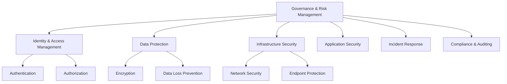
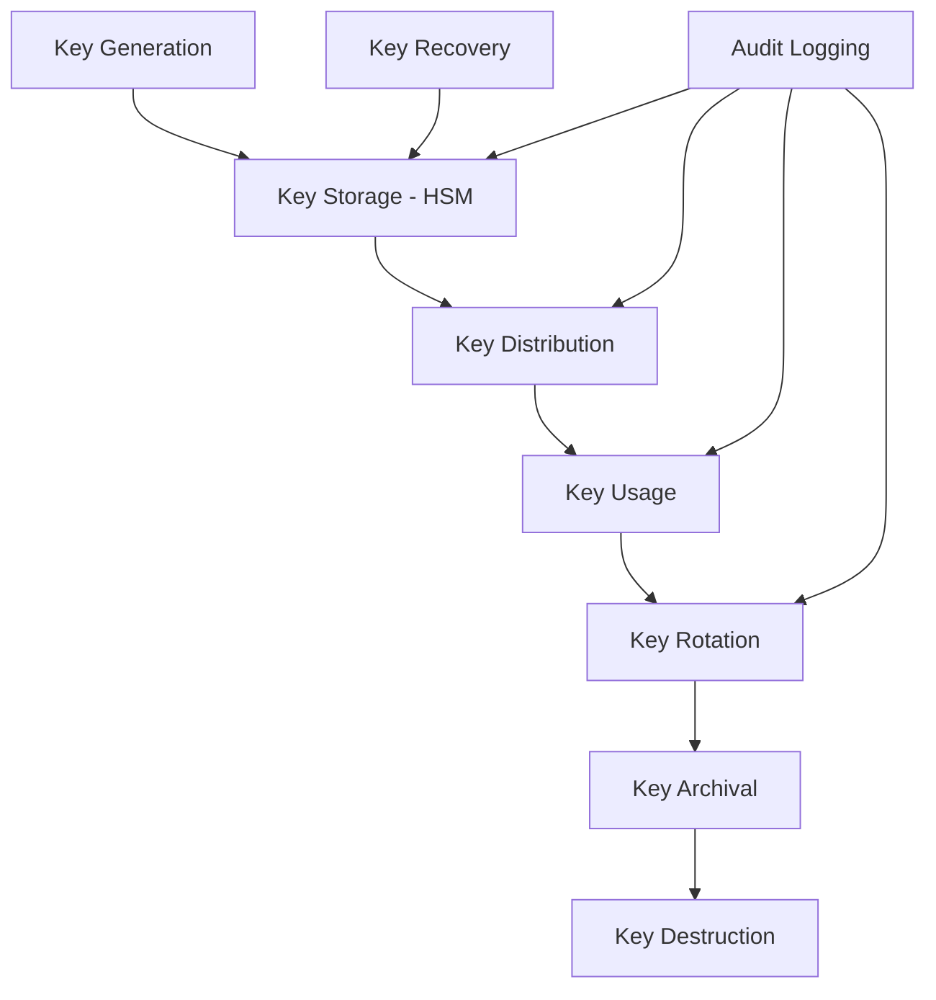
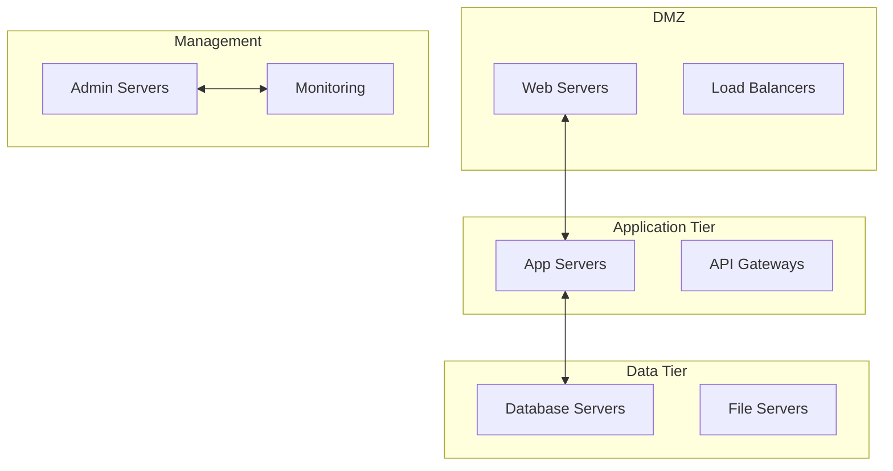
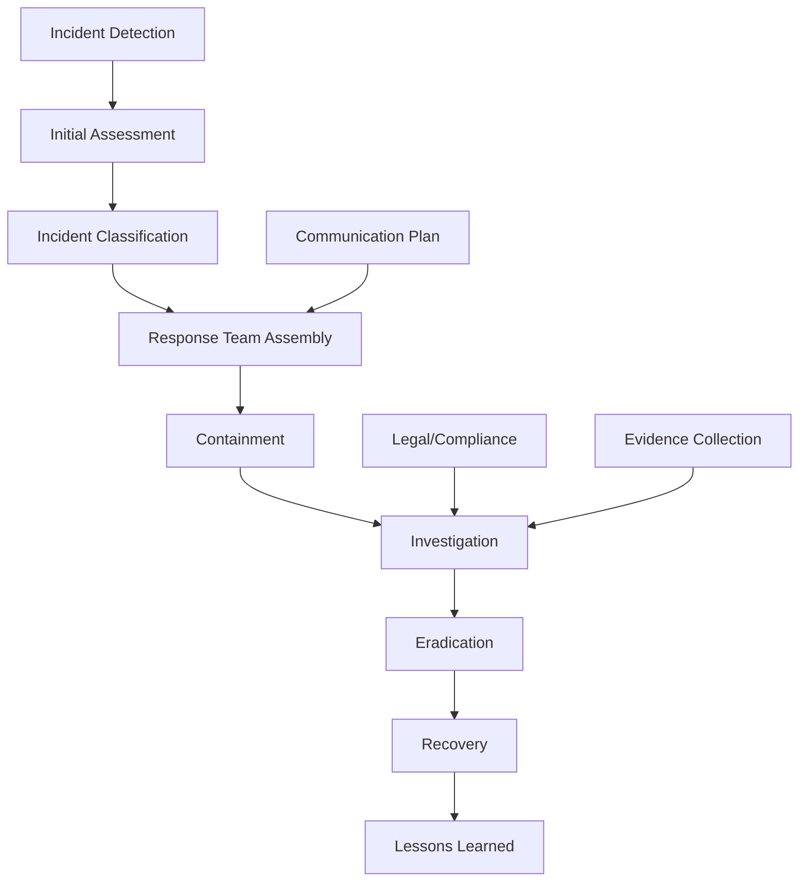

# Security Framework Implementation Guide

## Security Framework Overview

| Field              | Value              |
| ------------------ | ------------------ |
| **Document Type**  | Security Framework |
| **Version**        | 2.0                |
| **Classification** | Internal Use       |
| **Owner**          | [Security Team]    |
| **Last Updated**   | [Current Date]     |

## Executive Summary

This security framework provides comprehensive guidance for implementing security controls across all organizational systems and processes. It aligns with industry standards (ISO 27001, NIST, SOC 2) and regulatory requirements while supporting business objectives.

## Security Architecture Principles

### Core Security Principles

| Principle                 | Description                  | Implementation                                    |
| ------------------------- | ---------------------------- | ------------------------------------------------- |
| **Zero Trust**            | Never trust, always verify   | Multi-factor authentication, least privilege      |
| **Defense in Depth**      | Multiple layers of security  | Network, application, data, endpoint protection   |
| **Privacy by Design**     | Built-in privacy protection  | Data minimization, encryption, consent management |
| **Continuous Monitoring** | Real-time security oversight | SIEM, automated alerting, threat hunting          |
| **Shared Responsibility** | Security is everyone's job   | Training, awareness, clear roles                  |

### Security Framework Structure



## Identity and Access Management (IAM)

### Authentication Framework

#### Multi-Factor Authentication (MFA)
| User Type            | MFA Requirement | Methods                            | Exception Process  |
| -------------------- | --------------- | ---------------------------------- | ------------------ |
| **Administrators**   | Always required | Authenticator app + Hardware token | None               |
| **Privileged Users** | Always required | Authenticator app + SMS backup     | CISO approval only |
| **Standard Users**   | Risk-based      | Authenticator app + Email backup   | Manager approval   |
| **External Users**   | Always required | Authenticator app only             | None               |

#### Authentication Methods

| Method                 | Security Level | Use Cases                      | Implementation            |
| ---------------------- | -------------- | ------------------------------ | ------------------------- |
| **Hardware Tokens**    | High           | Admin access, critical systems | FIDO2/WebAuthn            |
| **Authenticator Apps** | High           | Daily access, standard systems | TOTP (Google Auth, Authy) |
| **Biometric**          | Medium         | Device access, convenience     | Windows Hello, TouchID    |
| **SMS**                | Low            | Backup only, legacy systems    | Encrypted carrier         |

### Authorization Model

#### Role-Based Access Control (RBAC)

| Role Category | Access Level | Permissions                   | Review Frequency |
| ------------- | ------------ | ----------------------------- | ---------------- |
| **Executive** | Strategic    | Read-only dashboards, reports | Quarterly        |
| **Manager**   | Departmental | Team data, approval workflows | Quarterly        |
| **Analyst**   | Functional   | Assigned data sets, tools     | Monthly          |
| **Admin**     | Technical    | System configuration          | Monthly          |
| **Guest**     | Limited      | Public information only       | Weekly           |

#### Privileged Access Management (PAM)


**PAM Requirements:**
- All privileged access requires approval
- Session recording for audit purposes
- Automatic access revocation after time limit
- Regular access reviews and recertification

### Identity Lifecycle Management

#### User Provisioning Process

| Stage            | Actions                                | Timeframe           | Responsible Party |
| ---------------- | -------------------------------------- | ------------------- | ----------------- |
| **Pre-boarding** | Account creation, role assignment      | 2 days before start | IT Security       |
| **Onboarding**   | Access activation, training completion | Day 1               | Manager + IT      |
| **Role Changes** | Permission updates, approvals          | Same day            | IT Security       |
| **Offboarding**  | Account deactivation, access removal   | Immediately         | HR + IT           |

## Data Protection Framework

### Data Classification

#### Classification Levels

| Level            | Description              | Handling Requirements                   | Examples                             |
| ---------------- | ------------------------ | --------------------------------------- | ------------------------------------ |
| **Public**       | No harm if disclosed     | Standard web security                   | Marketing materials, public websites |
| **Internal**     | Limited business impact  | Access controls, encryption in transit  | Employee directories, policies       |
| **Confidential** | Moderate business impact | Strong access controls, encryption      | Customer data, financial reports     |
| **Restricted**   | Severe business impact   | Strict controls, encryption, monitoring | Trade secrets, personal data         |

#### Data Handling Matrix

| Classification   | Storage                 | Transmission               | Sharing                    | Retention             |
| ---------------- | ----------------------- | -------------------------- | -------------------------- | --------------------- |
| **Public**       | Any approved location   | No special requirements    | Unrestricted               | Per business needs    |
| **Internal**     | Approved systems only   | TLS 1.3 minimum            | Internal users only        | 7 years maximum       |
| **Confidential** | Encrypted storage       | End-to-end encryption      | Authorized users only      | Business need + legal |
| **Restricted**   | Encrypted + access logs | Encrypted + DLP monitoring | Explicit approval required | Minimum necessary     |

### Encryption Standards

#### Encryption Requirements

| Data State          | Algorithm         | Key Length      | Implementation                       |
| ------------------- | ----------------- | --------------- | ------------------------------------ |
| **Data at Rest**    | AES               | 256-bit         | Transparent Database Encryption      |
| **Data in Transit** | TLS               | 1.3+            | Application layer encryption         |
| **Data in Use**     | Application-level | Per application | Tokenization, field-level encryption |
| **Backups**         | AES               | 256-bit         | Encrypted backup solutions           |

#### Key Management



**Key Management Standards:**
- Hardware Security Modules (HSM) for root keys
- Automated key rotation every 12 months
- Split knowledge and dual control for sensitive operations
- Comprehensive audit logging of all key operations

### Data Loss Prevention (DLP)

#### DLP Policies

| Policy                      | Scope                | Detection Method     | Action                       |
| --------------------------- | -------------------- | -------------------- | ---------------------------- |
| **Credit Cards**            | All systems          | Pattern matching     | Block + Alert                |
| **Social Security Numbers** | All systems          | Pattern matching     | Block + Alert                |
| **Customer Data**           | Email, Web, USB      | Content inspection   | Block + Log                  |
| **Source Code**             | Email, Cloud storage | File type + keywords | Alert + Manager notification |

## Infrastructure Security

### Network Security Architecture

#### Network Segmentation



#### Firewall Rules Matrix

| Source Zone | Destination Zone | Allowed Ports | Protocol | Justification         |
| ----------- | ---------------- | ------------- | -------- | --------------------- |
| Internet    | DMZ              | 80, 443       | TCP      | Web traffic           |
| DMZ         | Application      | 8080, 8443    | TCP      | Application traffic   |
| Application | Data             | 1433, 3306    | TCP      | Database access       |
| Management  | All              | 22, 3389      | TCP      | Administrative access |

### Endpoint Security

#### Endpoint Protection Requirements

| Component            | Standard             | Configuration                    | Update Frequency    |
| -------------------- | -------------------- | -------------------------------- | ------------------- |
| **Antivirus**        | Enterprise solution  | Real-time scanning               | Daily signatures    |
| **Firewall**         | Host-based           | Default deny                     | Monthly rule review |
| **Encryption**       | Full disk encryption | BitLocker/FileVault              | N/A                 |
| **Patch Management** | Automated patching   | Critical: 72hrs, Others: 30 days | Continuous          |

#### Device Management

| Device Type           | Management Tool   | Security Requirements                 | Compliance Check |
| --------------------- | ----------------- | ------------------------------------- | ---------------- |
| **Corporate Laptops** | MDM solution      | Full encryption, AV, firewall         | Weekly           |
| **Mobile Devices**    | MAM solution      | App containerization, remote wipe     | Daily            |
| **BYOD**              | Limited access    | VPN only, no local data               | Monthly          |
| **IoT Devices**       | Network isolation | Default password change, segmentation | Quarterly        |

### Cloud Security

#### Cloud Security Framework

| Security Control        | AWS        | Azure           | GCP           | Implementation     |
| ----------------------- | ---------- | --------------- | ------------- | ------------------ |
| **Identity Management** | IAM        | Azure AD        | Cloud IAM     | SSO integration    |
| **Network Security**    | VPC        | Virtual Network | VPC           | Micro-segmentation |
| **Data Protection**     | KMS        | Key Vault       | Cloud KMS     | Encryption keys    |
| **Monitoring**          | CloudTrail | Monitor         | Cloud Logging | SIEM integration   |

#### Cloud Configuration Standards

```yaml
# Example Azure Security Configuration
security_config:
  encryption:
    storage_accounts: true
    sql_databases: true
    virtual_machines: true
  
  network:
    nsg_rules: restrictive
    firewall: enabled
    ddos_protection: standard
  
  monitoring:
    security_center: standard_tier
    log_analytics: enabled
    alert_rules: comprehensive
  
  identity:
    conditional_access: enabled
    mfa: required
    privileged_access: pim_enabled
```

## Application Security

### Secure Development Lifecycle (SDLC)

#### Security Gates

| Phase           | Security Activities                   | Tools                     | Gate Criteria                |
| --------------- | ------------------------------------- | ------------------------- | ---------------------------- |
| **Design**      | Threat modeling, architecture review  | STRIDE, attack trees      | Security review completed    |
| **Development** | Secure coding, code review            | Static analysis (SAST)    | No high-severity findings    |
| **Testing**     | Security testing, penetration testing | Dynamic analysis (DAST)   | All critical issues resolved |
| **Deployment**  | Security configuration, monitoring    | Runtime protection (RASP) | Security controls verified   |

#### Application Security Controls

| Control                | Implementation              | Testing Method            | Compliance Standard          |
| ---------------------- | --------------------------- | ------------------------- | ---------------------------- |
| **Input Validation**   | Server-side validation      | Fuzzing, boundary testing | OWASP Top 10                 |
| **Authentication**     | Multi-factor authentication | Penetration testing       | NIST 800-63                  |
| **Session Management** | Secure tokens, timeout      | Session testing           | OWASP ASVS                   |
| **Access Control**     | Role-based permissions      | Authorization testing     | Principle of least privilege |

### API Security

#### API Security Standards

```yaml
# API Security Configuration
api_security:
  authentication:
    method: oauth2
    token_expiry: 3600
    refresh_token: true
  
  authorization:
    model: rbac
    scopes: granular
    rate_limiting: true
  
  data_protection:
    encryption: tls_1_3
    sensitive_data: tokenized
    logging: no_pii
  
  monitoring:
    api_gateway: enabled
    anomaly_detection: true
    threat_protection: enabled
```

#### API Security Testing

| Test Type                  | Frequency     | Tools                 | Success Criteria             |
| -------------------------- | ------------- | --------------------- | ---------------------------- |
| **Authentication Testing** | Every release | Burp Suite, OWASP ZAP | No authentication bypass     |
| **Authorization Testing**  | Every release | Custom scripts        | Proper access controls       |
| **Input Validation**       | Continuous    | SAST tools            | No injection vulnerabilities |
| **Rate Limiting**          | Monthly       | Load testing tools    | Rate limits enforced         |

## Incident Response Framework

### Incident Classification

#### Incident Severity Levels

| Level        | Description                      | Response Time | Stakeholders                 | Communication        |
| ------------ | -------------------------------- | ------------- | ---------------------------- | -------------------- |
| **Critical** | System compromise, data breach   | 15 minutes    | CISO, CTO, CEO               | Immediate escalation |
| **High**     | Security control failure         | 1 hour        | Security team, IT management | Hourly updates       |
| **Medium**   | Policy violation, minor incident | 4 hours       | Security team                | Daily updates        |
| **Low**      | Security event, informational    | 24 hours      | Security analyst             | Weekly summary       |

### Incident Response Process



#### Response Team Roles

| Role                   | Responsibilities                  | Contact Method       | Backup           |
| ---------------------- | --------------------------------- | -------------------- | ---------------- |
| **Incident Commander** | Overall response coordination     | 24/7 phone           | Deputy Commander |
| **Security Analyst**   | Technical investigation           | Secure communication | Senior Analyst   |
| **IT Operations**      | System containment/recovery       | Operations center    | On-call engineer |
| **Legal Counsel**      | Legal implications, notifications | Secure phone         | External counsel |
| **Communications**     | Stakeholder communication         | Multiple channels    | Deputy Comms     |

### Business Continuity and Disaster Recovery

#### Recovery Objectives

| System Type           | RTO (Recovery Time) | RPO (Recovery Point) | Backup Frequency      | Testing Frequency |
| --------------------- | ------------------- | -------------------- | --------------------- | ----------------- |
| **Critical Systems**  | 4 hours             | 15 minutes           | Real-time replication | Monthly           |
| **Important Systems** | 24 hours            | 1 hour               | Hourly backups        | Quarterly         |
| **Standard Systems**  | 72 hours            | 4 hours              | Daily backups         | Semi-annually     |
| **Non-critical**      | 1 week              | 24 hours             | Weekly backups        | Annually          |

## Compliance and Risk Management

### Compliance Framework

#### Regulatory Requirements

| Regulation | Scope                | Key Requirements                               | Assessment Frequency |
| ---------- | -------------------- | ---------------------------------------------- | -------------------- |
| **GDPR**   | EU personal data     | Consent, data protection, breach notification  | Annual               |
| **SOX**    | Financial reporting  | Internal controls, audit trails                | Quarterly            |
| **HIPAA**  | Healthcare data      | Administrative, physical, technical safeguards | Annual               |
| **SOC 2**  | Service organization | Security, availability, confidentiality        | Annual               |

#### Compliance Monitoring

```yaml
# Compliance Monitoring Configuration
compliance_monitoring:
  gdpr:
    data_mapping: automated
    consent_tracking: enabled
    breach_detection: real_time
    
  sox:
    access_controls: reviewed_quarterly
    audit_logs: comprehensive
    segregation_of_duties: enforced
    
  hipaa:
    encryption: required
    access_logs: detailed
    risk_assessments: annual
```

### Risk Assessment Framework

#### Risk Assessment Matrix

| Probability     | Impact: Low | Impact: Medium | Impact: High | Impact: Critical |
| --------------- | ----------- | -------------- | ------------ | ---------------- |
| **Very Likely** | Medium      | High           | Critical     | Critical         |
| **Likely**      | Low         | Medium         | High         | Critical         |
| **Possible**    | Low         | Low            | Medium       | High             |
| **Unlikely**    | Low         | Low            | Low          | Medium           |

#### Risk Treatment Strategies

| Risk Level   | Strategy             | Examples                                 | Review Frequency |
| ------------ | -------------------- | ---------------------------------------- | ---------------- |
| **Critical** | Immediate mitigation | System shutdown, emergency patching      | Weekly           |
| **High**     | Planned mitigation   | Security controls, process changes       | Monthly          |
| **Medium**   | Risk monitoring      | Enhanced monitoring, additional controls | Quarterly        |
| **Low**      | Risk acceptance      | Document and monitor                     | Annually         |

## Security Metrics and KPIs

### Security Metrics Dashboard

| Metric Category              | Metric                                      | Target    | Current   | Trend   |
| ---------------------------- | ------------------------------------------- | --------- | --------- | ------- |
| **Vulnerability Management** | Mean time to patch critical vulnerabilities | <72 hours | [Current] | [Trend] |
| **Incident Response**        | Mean time to detect incidents               | <4 hours  | [Current] | [Trend] |
| **Access Management**        | Percentage of accounts with MFA             | 100%      | [Current] | [Trend] |
| **Security Training**        | Employee security training completion       | 100%      | [Current] | [Trend] |

### Security Reporting

#### Monthly Security Report Template

1. **Executive Summary**
   - Key security metrics
   - Major incidents and responses
   - Risk posture changes

2. **Threat Landscape**
   - External threat intelligence
   - Attack trends affecting industry
   - Recommended actions

3. **Security Operations**
   - Incident statistics
   - Vulnerability management status
   - Security control effectiveness

4. **Compliance Status**
   - Regulatory compliance updates
   - Audit findings and remediation
   - Policy compliance metrics

## Implementation Roadmap

### Phase 1: Foundation (Months 1-6)
- [ ] Deploy multi-factor authentication
- [ ] Implement endpoint protection
- [ ] Establish incident response team
- [ ] Complete risk assessment

### Phase 2: Enhancement (Months 7-12)
- [ ] Deploy SIEM solution
- [ ] Implement DLP controls
- [ ] Establish security metrics
- [ ] Complete compliance assessments

### Phase 3: Optimization (Months 13-18)
- [ ] Automate security processes
- [ ] Advanced threat detection
- [ ] Security orchestration
- [ ] Continuous compliance monitoring

---
**Document Classification**: Internal Use  
**Owner**: [CISO Name]  
**Approved By**: [Executive Team]  
**Last Review**: [Date]  
**Next Review**: [Date]
